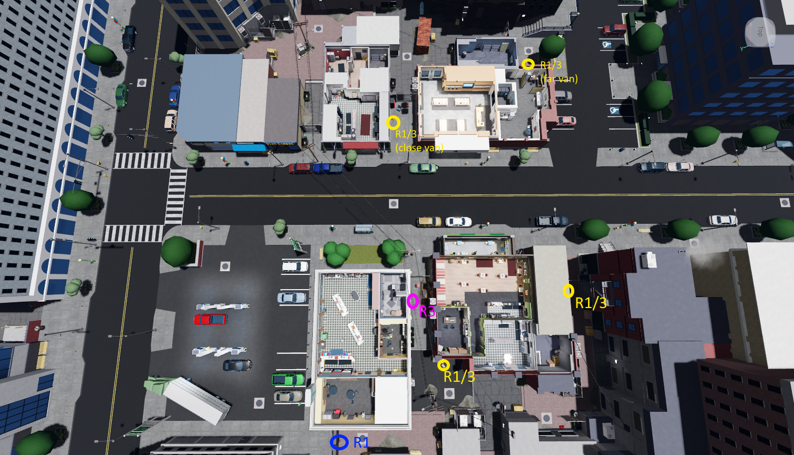

# Rush Hour (RH)

Rush Hour is featured on the “No booster, no gamepass” and “Booster/gamepass” versions of NCDR

(r3 now gets cafe folder+package)

## Server Code Callouts

To quickly communicate the server code to r2, we send the server code through text where each symbol has a corresponding letter code. The code will either be sent through roblox chat or the discord lobby thread. You should decide on this with r2 before rotation starts depending on roblox chat restrictions.

Σ = E\
ｷ = T\
◆ = R\
_ = L\
▪ = S\
▣ = 2S\
◒ = O\
◉ = 2O\
▸ = A\
empty = -

The code will be sent in a 3x3 grid, just like it appears in the folder.\
For example if you found this code

You would type

L--\
2OE-\
-2O-

The dashes at the end of the line can be ignored so you could also type

L\
2OE\
-2O

However if a line is completely empty, you must send at least 1 dash (unless it is the last line)\
You can use the following site to practise typing the code\
<https://avivendolius.github.io/Hexcode-Practice-For-Role-1-v1.1/>
