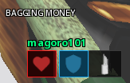
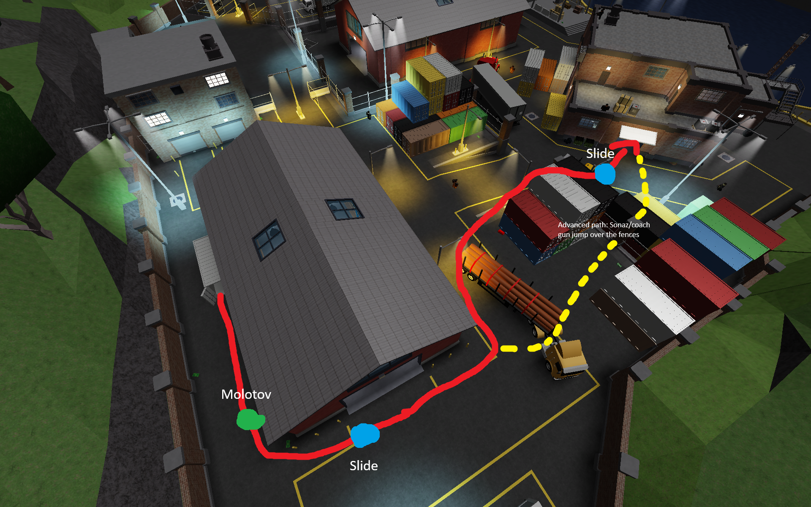
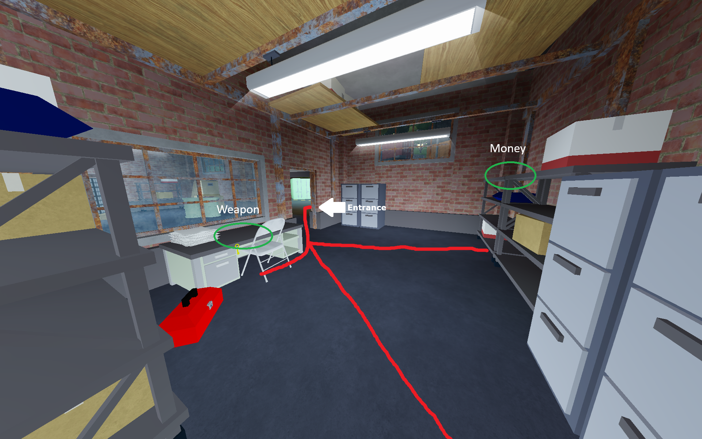
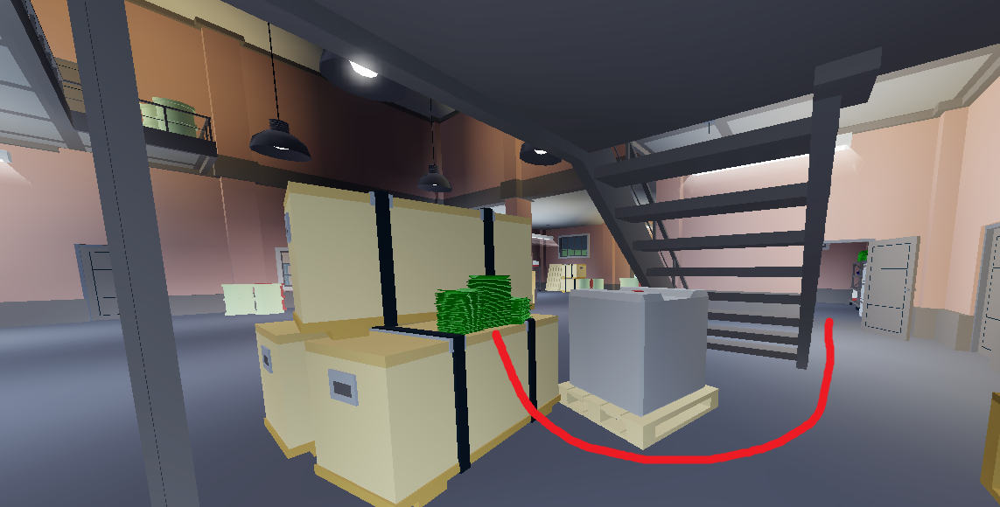
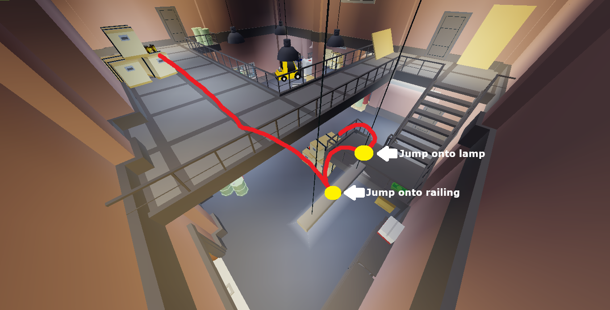
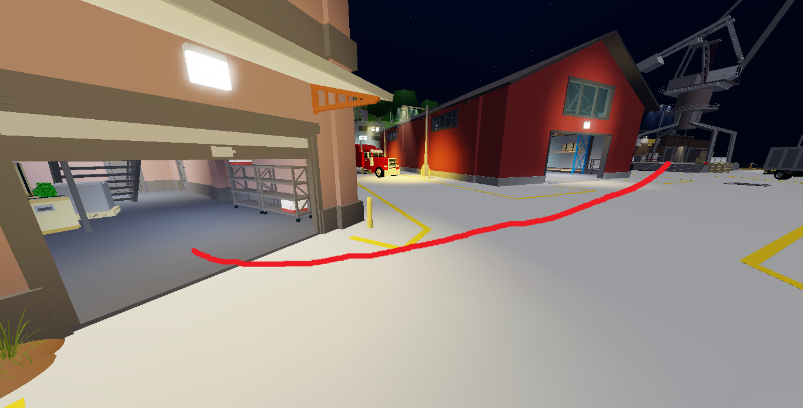
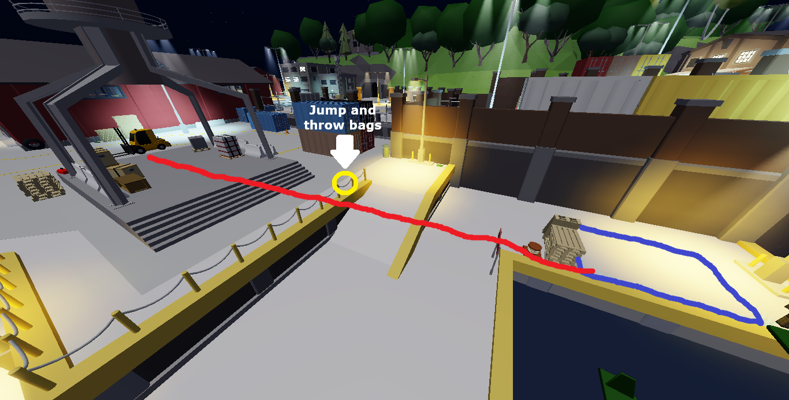

# Depot

Depot is featured on all 3 versions of NCDR.

**<u>READ THE SECTION BELOW</u>**

## Calling out bags

In Depot all roles are almost guaranteed to get a set amount of bags, that being both r1/r2 getting 2 bags in total from the transport warehouse and r3/r4 getting 3 bags in total from 6g, leaving one bag remaining to reach six in total, we refer to this as an “extra bag”, an extra bag can be obtained by any role, when someone obtains it they will use the “Yes!” callout to signal to the other players that they don’t need to get it anymore, and can continue their pathing normally.

Your job as r2 is to make the “Yes!” callout if either you or r1 obtained an extra bag in transport. Since you have to use the callout in case r1 gets the bag it’s important to pay attention to the ui at the bottom of your screen that tells you if r1 is currently getting a bag.

1. Mask up and head to the transport warehouse, either following the normal red path, or the slightly faster yellow path using the Coach Gun.

2. Inside the warehouse, look for and bag the following loot if it spawned, you only need to get two bags in total between you and r1, or 3 if you have to get an extra bag (read information about it above).

3. Exit the warehouse and head over to the crane, remember to juggle your bags if you are carrying a weapon, as it’s a heavy bag and slows you down.

4. Head to the escape zone, jump and throw your bags when you are going past the railings, then go into the escape zone.

