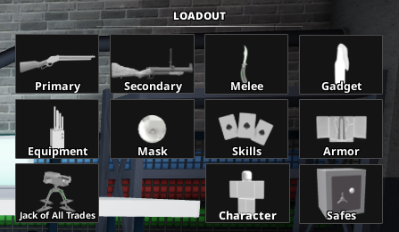
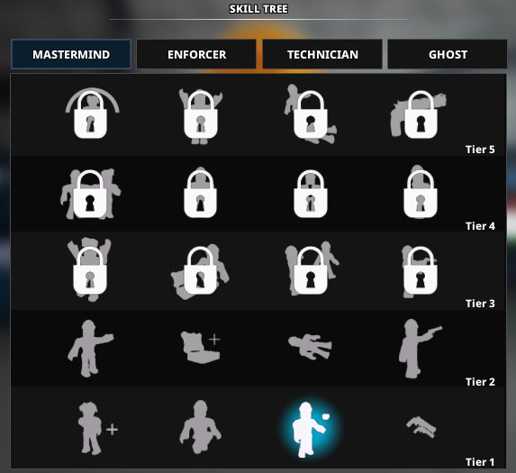
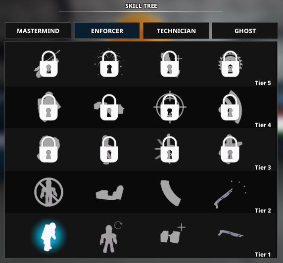
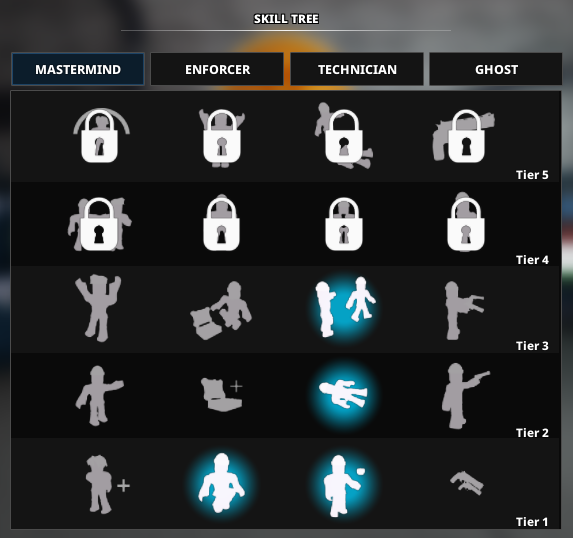
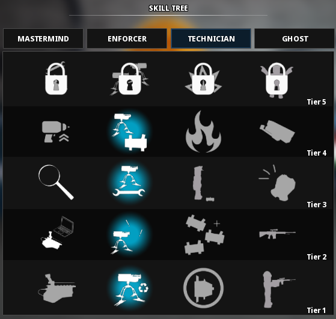
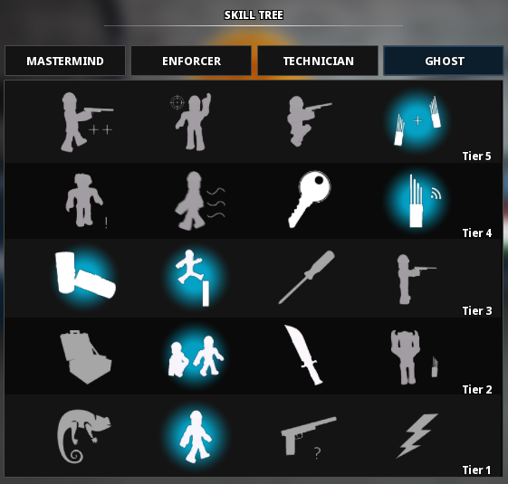

# Role 2

For video guides go [here](../resources.md)

## Loadout

Primary: Breaker 12G with the “Butcher’s Axe” and the “Oil Filter” attachments.\
Secondary: Any of your choice.\
Melee: Knife / Balisong Knife. Both are the same.\
Gadget: Molotov. IMPORTANT: Change to Saw for Rush Hour\
Equipment: ECM Device.\
Armor: Suit.\
Jack of All Trades: Optional.

## Skills

### Pre-skills

Before depot

### Skill Break 1

After depot/Before nightclub

You can use any other skills as you wish as long as you follow these skill breaks

!!! warning

    Do NOT use the “Leader” skill in the mastermind tree.
