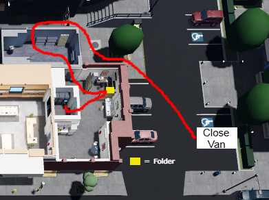
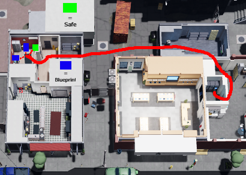
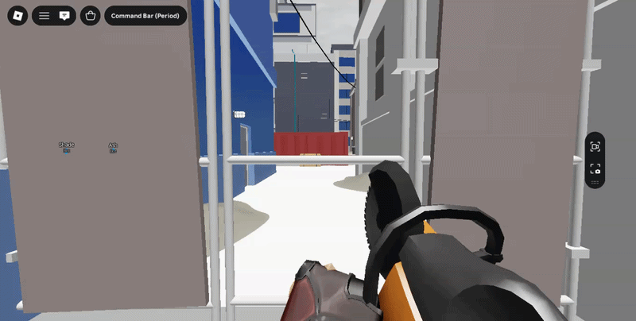
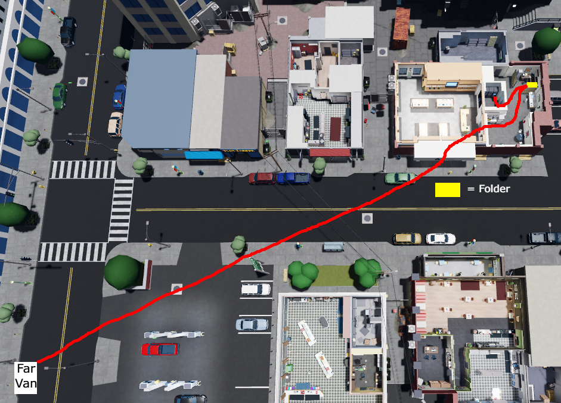
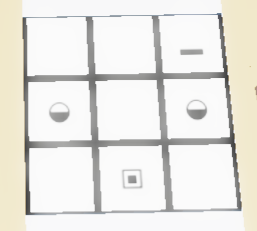

# Rush Hour

Rush Hour is featured on “No Booster, No Gamepass” and “Booster/Gamepass” versions of NCDR.

## Close Van Variant

1. Mask up and run to the right side, then open the fence using your saw (hit the middle iron bar as shown in the gif below).

2. Enter the tech store from the back door, then go to the office on your left side and open the folder to check if it has the server code.

3. If you found the server code inside the folder, input it in the keypad. If not, wait for one of your teammates to call it out in the chat (read information about it below) or in the Discord thread, then hack the computer.

4. Return to the back area of the tech store, head over to the left side and into the butcher store.

5. Enter the manager room, find and bag the blueprint, then open the safe and grab the package inside.

6. Return to the server room and wait for the hack to finish, then collect the USB from the computer.

## Far Van Variant

1. Mask up and run to the tech store, enter from the front entrance and into the office room behind the counter.

2. Go to the office on the top right of the room and check the folder to see if it has the server code.

3. If you found the server code inside the folder, input it in the keypad. If not, wait for one of your teammates to call it out in the chat (read information about it below) or in the Discord thread, then hack the computer.

4. Return to the back area of the tech store, head over to the left side and into the butcher store.

5. Enter the manager room, find and bag the blueprint, then open the safe and grab the package inside.

6. Return to the server room and wait for the hack to finish, then collect the USB from the computer.

## Server Code

We use certain letters to represent all of the symbols in the code, and this way quickly share it through the Roblox chat:

Σ = e\
ｷ = t\
◆ = r\
_ = l\
▪ = s\
▣ = 2s\
◒ = o\
◉ = 2o\
▸ = a\
empty = -

For example: if someone types

--l\
o-o\
-2s-

This is the code you have to input:

!!! info "Note"

    players may omit training spaces. so 2s-- becomes just 2s

You can use this website to practice entering the server code in the keypad:\
<https://avivendolius.github.io/Hexcode-Practice-For-Role-2-v1.1/>

!!! info "Note"

    It’s important to know which of your teammates you can chat with in Roblox before starting a rot. This way you will know if they can communicate the code to you through Roblox chat or if they have to send it through the lobby thread and decide what method to use.

---

**Good luck on your application!**

It’s heavily recommended that you try practicing your pathing for each heist before doing your first rotation, as well as learning the map layouts if you are very new to the game. If you have any questions you can ask in the help channel in the Discord server.
