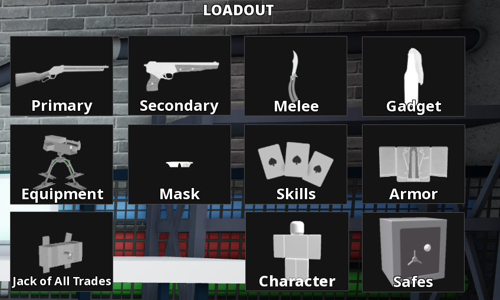
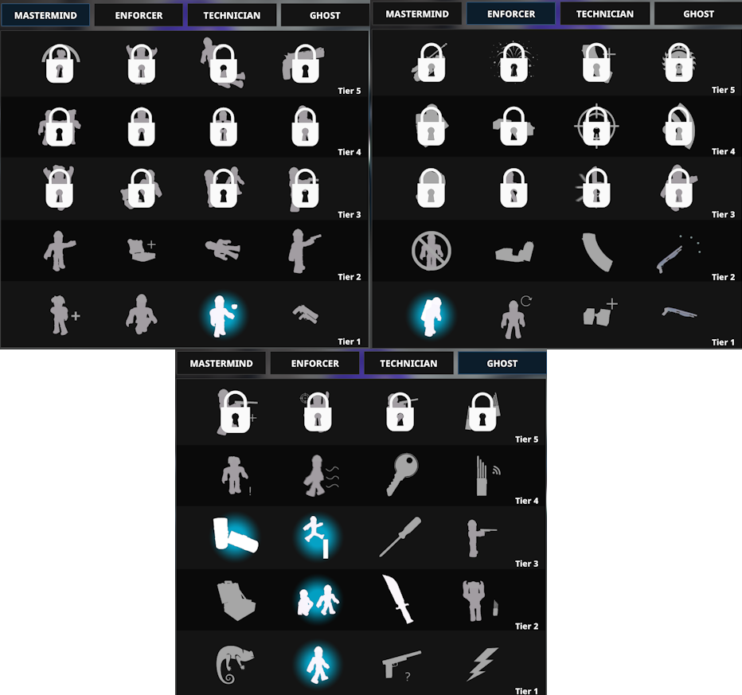
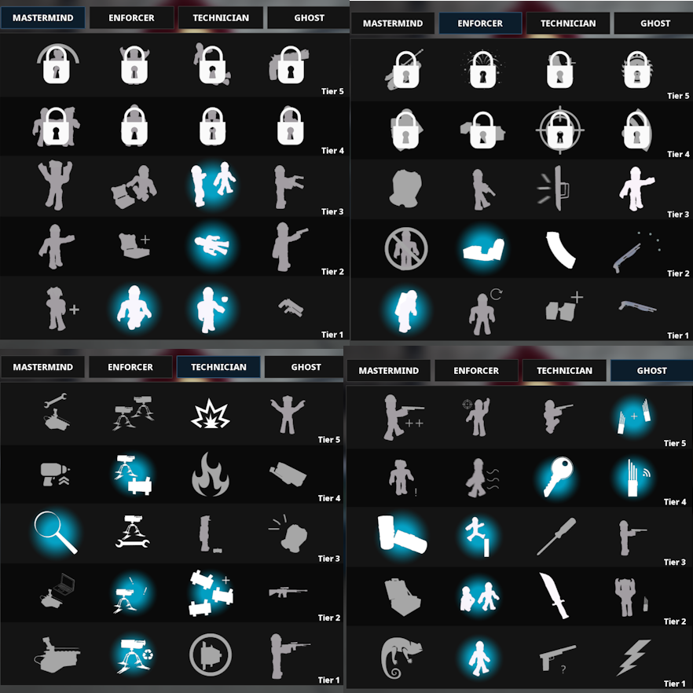

# Role 3

## Loadout

Primary: Breaker 12G\
Primary Barrel Extension: Oil Filter\
Primary Underbarrel: Butcher’s Axe

Secondary: TP-82 Sonaz\
Secondary Barrel Extension: Interceptor\
Secondary Barrel: Self-Loading Barrel

Gadget: Molotov

Armour: Suit

Equipment: Sentry Gun (Depot), ECM Device (Nightclub, Rush Hour)\
Jack of All Trades: Trip Mine (Rush Hour)

## Skills

### Pre-skills

These are the skills you get before starting the first heist

### Skill Break 1

These are the skills you get when you return to the lobby to change heists for the first time

