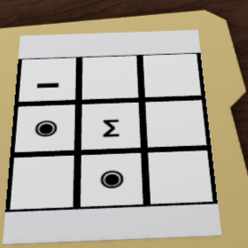
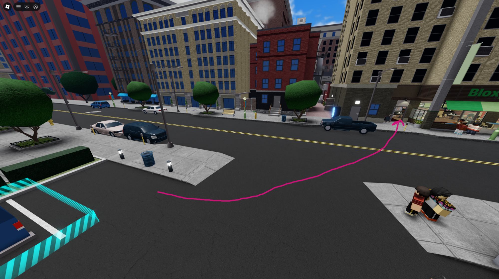
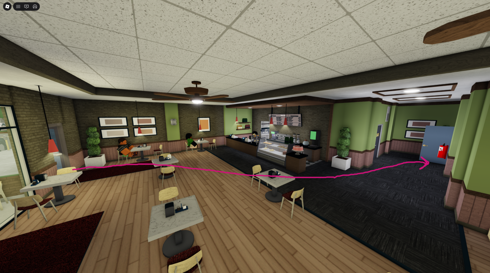
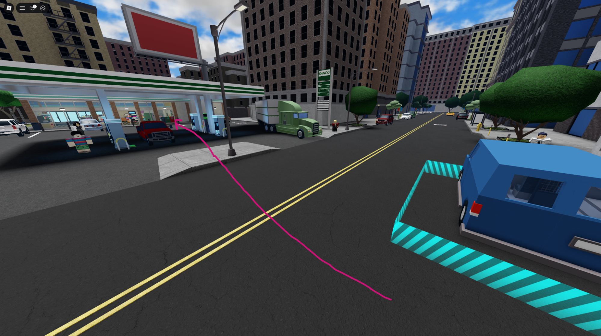
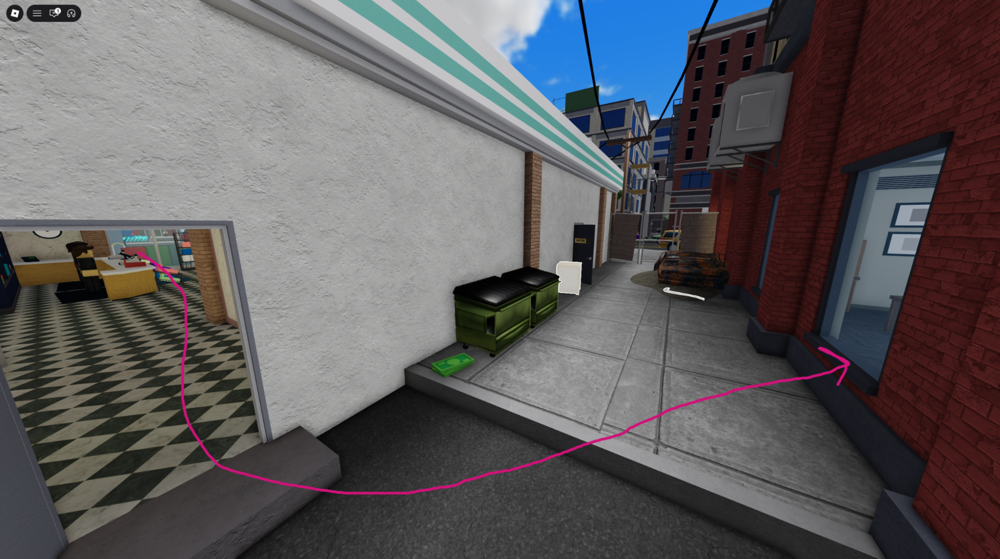
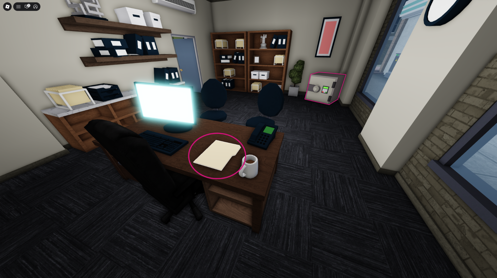
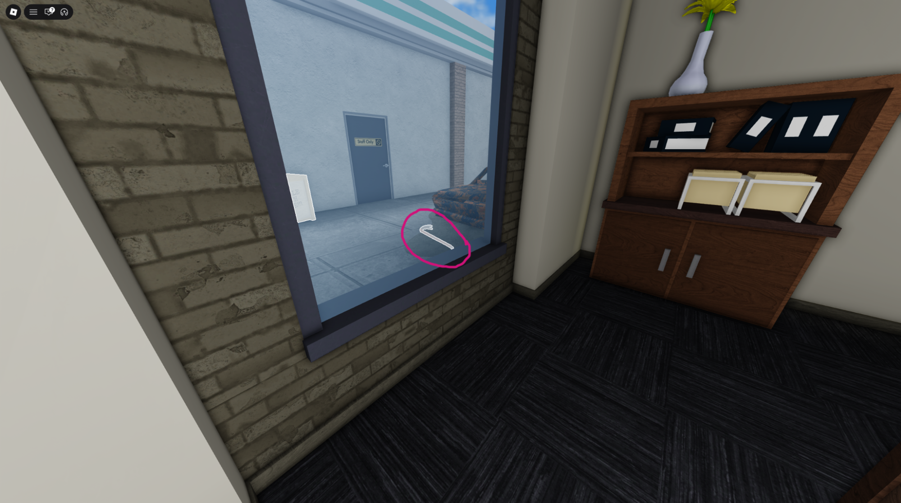
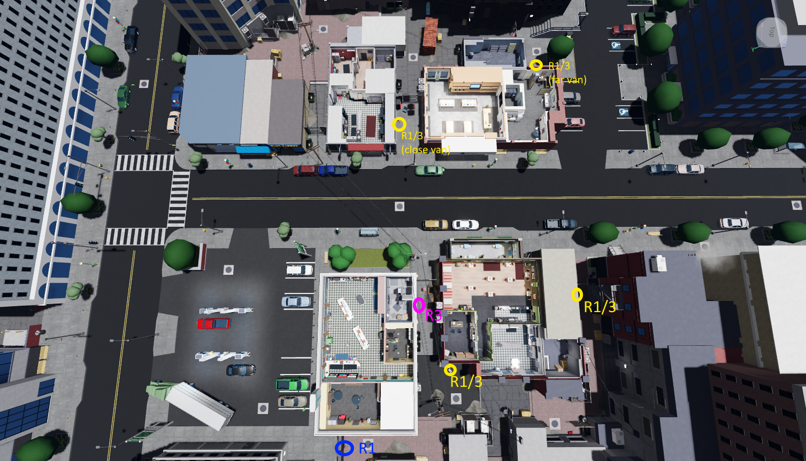
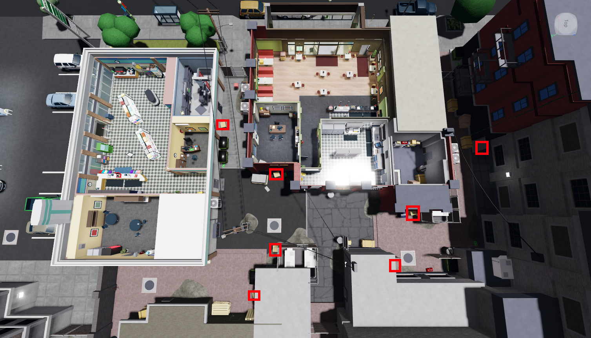

# Rush Hour (RH)

Rush Hour is featured on “No Booster, No Gamepass” and “Booster/Gamepass” versions of NCDR

## Server Code Callouts

To quickly communicate the server code to r2, we send the server code through text where each symbol has a corresponding letter code. The code will either be sent through roblox chat or the discord lobby thread. You should decide on this with r2 before rotation starts depending on roblox chat restrictions.

Σ = e\
ｷ = t\
◆ = r\
_ = l\
▪ = s\
▣ = 2s\
◒ = o\
◉ = 2o\
▸ = a\
empty = -

The code will be sent in a 3x3 grid, just like it appears in the folder.

For example if you found this code

You would type

l--\
2oe-\
-2o-

The dashes at the end of the line can be ignored so you could also type

l\
2oe\
-2o

However if a line is completely empty, you must send at least 1 dash (unless it is the last line)

You can use the following site to practise typing the code\
<https://avivendolius.github.io/Hexcode-Practice-For-Role-1-v1.1/>

## Route

1. Go to the cafe room with the safe and folder

    “Close” Van Route

“Far” Van Route

IMPORTANT: Go through the window of the gas station instead of the doors as the doors have metal detectors that will set off the alarm

2. Open the folder, if it has the server code, call it out to r2\
Place a trip min on the safe\
While waiting for the tripmine to explode, check this crowbar spawn

3. Grab the package from the safe\
Continue checking crowbar spawns if a crowbar didn’t spawn by the window

4. Start opening crates on the gas station/cafe side of the map

5. Once all crates on this side of the map have been opened, secure them into the van. Help r4 move bags or open crates on the other side of the map if you finish early
