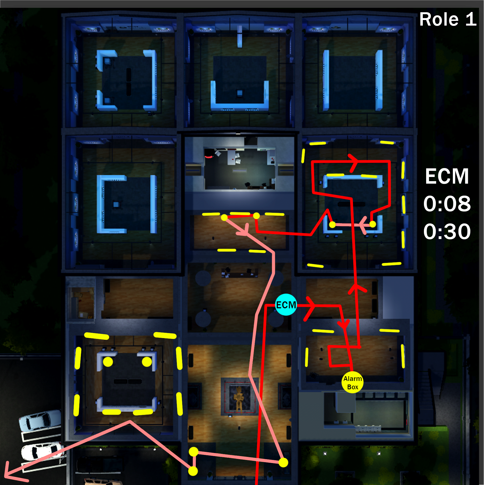
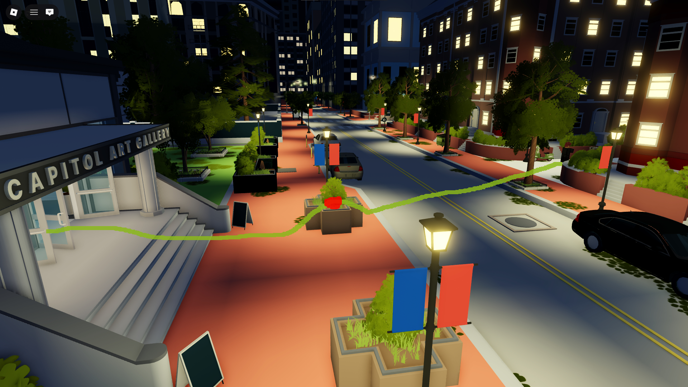
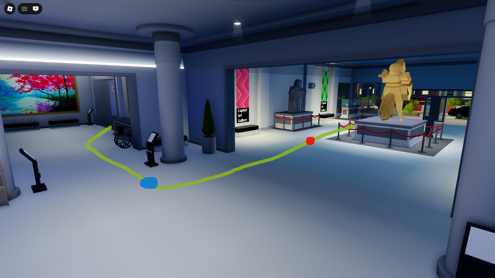
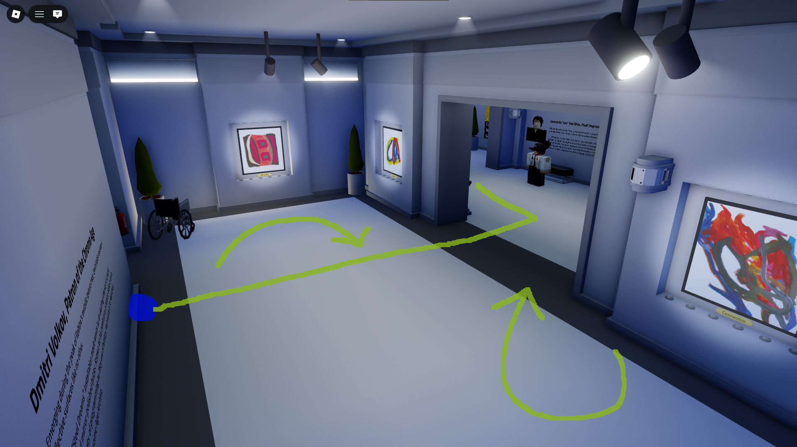
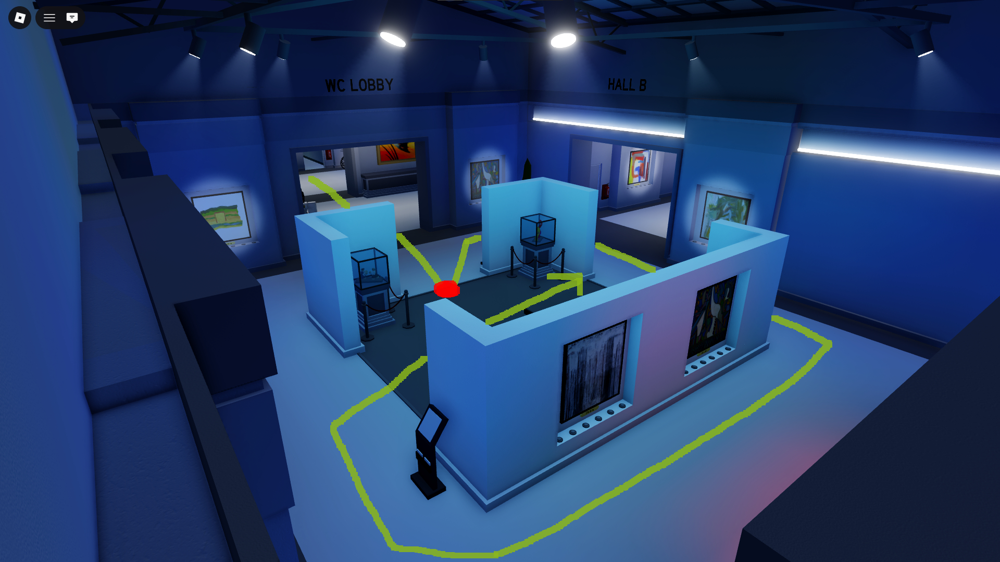
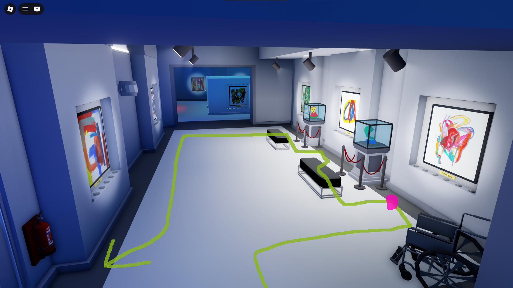
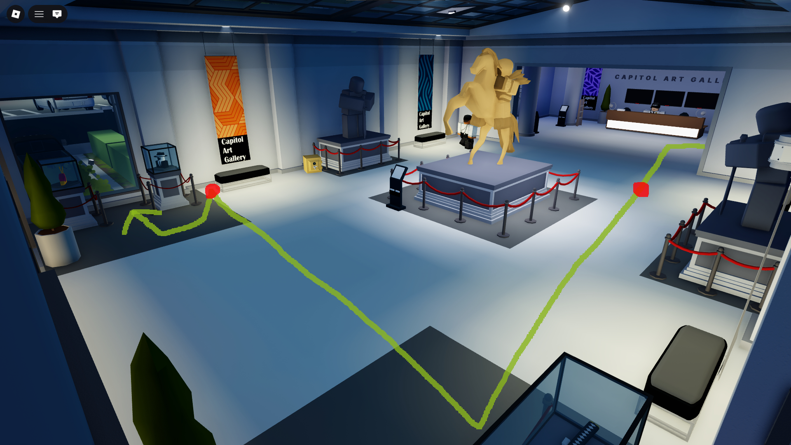
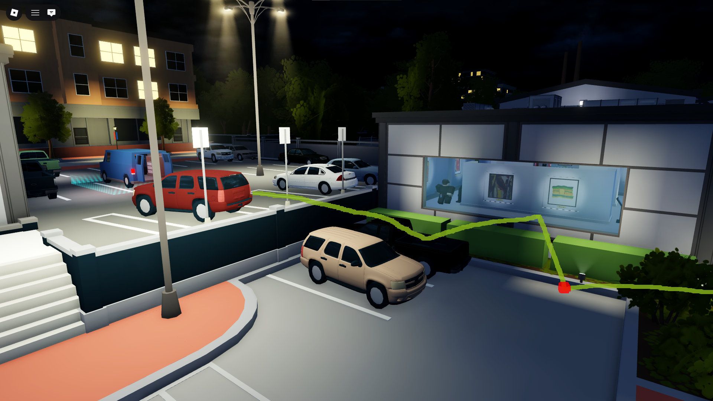

# Art Gallery (AG)

Art Gallery is featured on the "No Gamepass, No Booster" and "Booster/Gamepass" versions of SSD

1. At the beginning, mask up, run forward, turn back, boost your teammates, run towards the entrance, and use your molotov at the red circle.

2. After entering the art gallery, run towards the bottom-right room. While running, place down your ECM when you hit the red circle and slide when you hit the blue circle.

3. While still placing down your ECM, you will end up at the alarm box which is a colored purple circle (if it's there). Then you will check the paintings' 'sold' stickers, starting from the left and ending on the right (checking clockwise).

4. When you enter the middle-right room, use your molotov to break the glasses containing loose loot. Afterwards, check the paintings for 'sold' stickers, starting from the left and ending on the right (clockwise).

5. When you enter the middle room, position yourself to the side of both glass loose loot cases (marked with a pink circle) to break both of them with your Breaker 12G. Then loot the room as shown by the yellow navigation line.

6. When running towards the entrance through the single door, pull out your weapon to break the glass containing loose loot, then slide to the other two and position yourself as shown by the red circle to break both of them at the same time.

7. After grabbing the loose loot and breaking through the window to the outside, use your molotov at the red circle (on the outside ground). This way, you can avoid taking damage from the fire while throwing bags towards the van.

