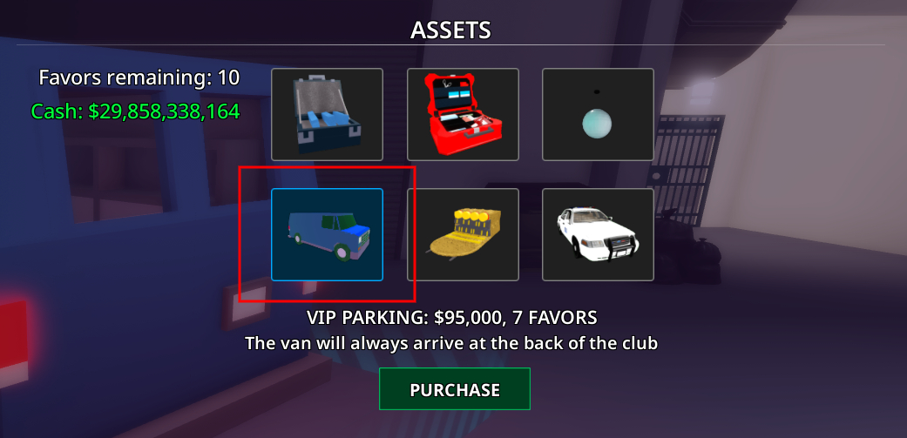
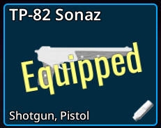
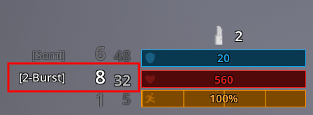
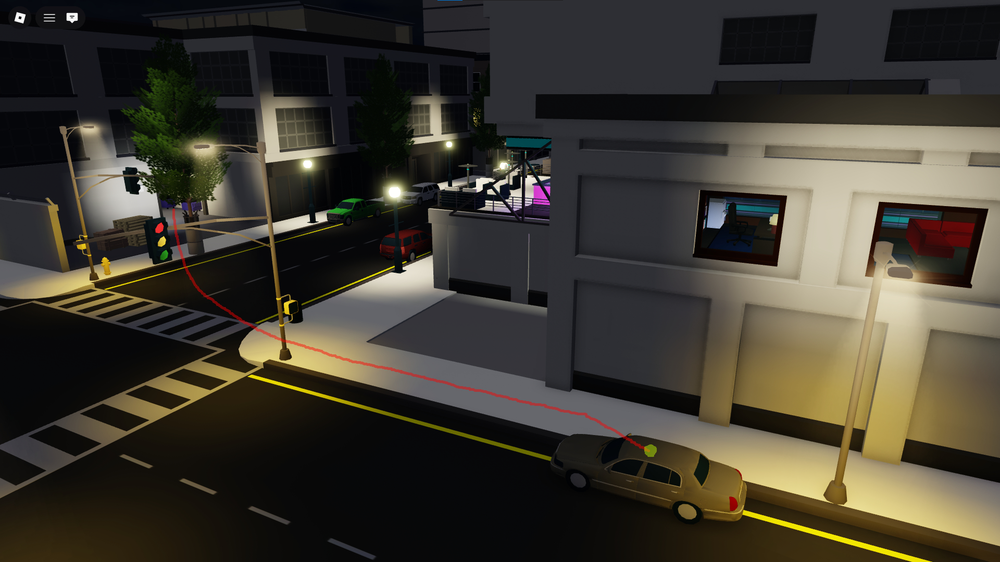
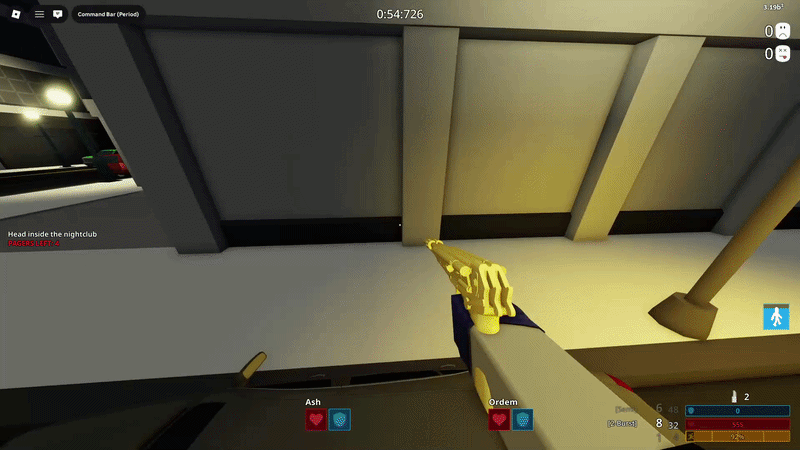
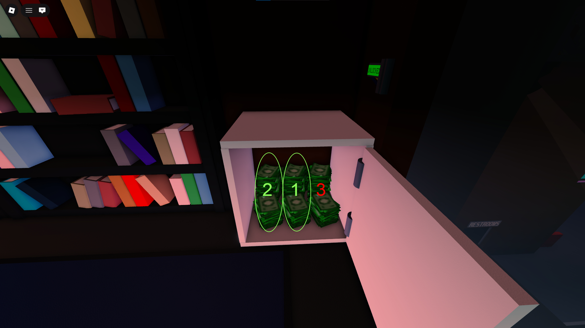
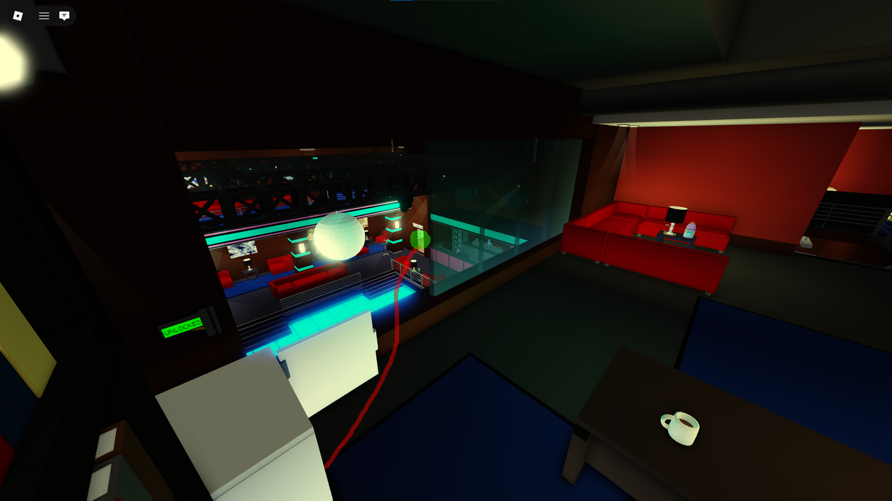
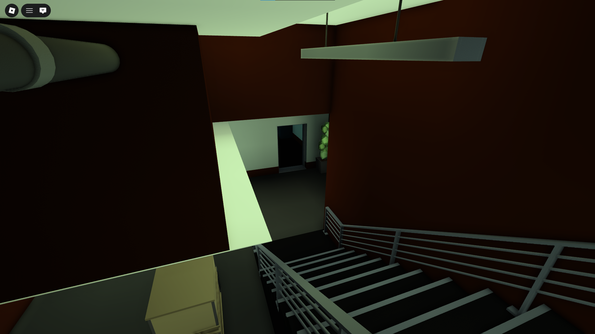
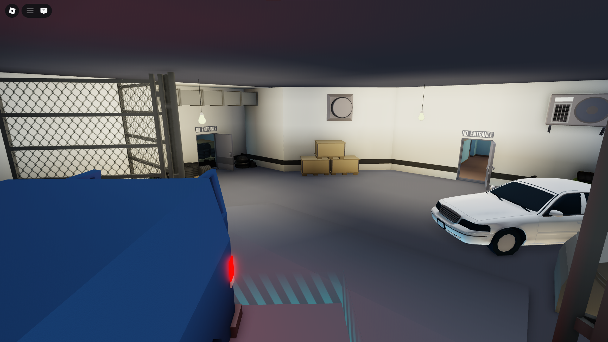

# Nightclub (NC)

Nightclub is featured on the “Booster/Gamepass” and “Booster and Gamepass” versions of SSD

## IMPORTANT NOTES

- Before beginning this heist you **must** have TP-82 Sonaz Equipped for your Secondary.
- You must buy the VIP Parking Asset.
- First Nightclub loot everything, Second Nightclub loot Money only.

1. At the beginning, run forward & turn behind to boost your teammates then immediately swap to molotov to give yourself a second wind boost after that swap to your Secondary and make sure it's on **Burst Mode**.

2. Make your way to the Car on the street shown below.

3. Use your Secondary Weapon to enter through the window like shown below.

    How do you perform this jump?

    - To perform this jump you **must** have your Secondary weapon (TP-82 Sonaz) on **Burst Mode**, then face the windows on top of the car.
    - To jump further you **must** shoot the gun and jump at the same exact time. (As you click **LMB** press **Space** as well).

4. After you enter the Manager’s Office through the window, proceed to open your safe with your **ECM**.

    Make sure to use “Yes” Call-out if your safe contains Money Loot.

    If your safe contains Money Loot, make sure to loot the middle one first then the left.
    You are still meant to loot the Third Money Loot if another role hasn’t reached your safe to grab it.

5. **THIS PART ONLY APPLIES FOR SECOND NIGHTCLUB**, If your safe did not contain Money Loot you **must** go for either the **Office** or **Basement** to help bag or carry the Money Loot.

    If “Yes” Call-out came from the **Office**, break the windows facing the dancing pit and jump down to make your way to the **Office**.

If “Yes” Call-out came from the **Basement**, run towards the door shown below and make your way to the **Basement**.

6. After looting, throw the bags into the **Escape Van** which is parked behind the Nightclub.

