# Shadow Raid (SR)

Shadow Raid is featured on the "No Gamepass, No Booster" and "Booster/Gamepass" versions of SSD.

1. At the beginning, mask up, shoot your gun, run forward, turn back, boost your teammates, run towards the entrance, and use your molotov at the yellow circle.

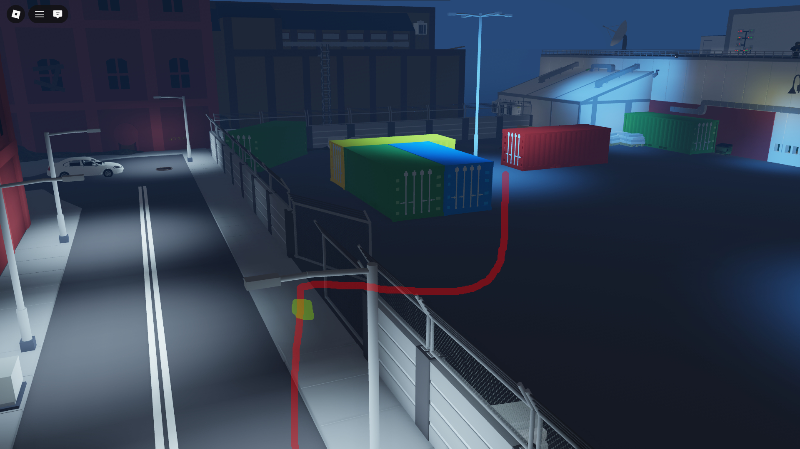

2. Lockpick the red container shown below and loot the containings if they are spawned.

If there's only one of the loot inside, take that loot inside with you.
If there's both loot inside, throw them towards the red container closer to the entrance. Do NOT bring two loot bags inside with you.

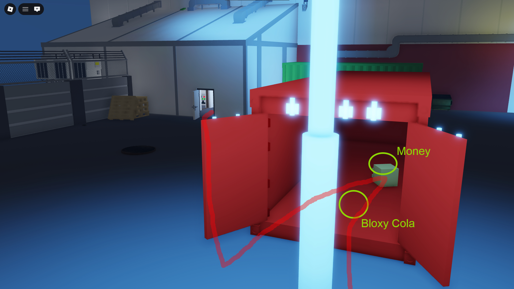

3. Time your sentry placement in front of the staircase like shown below.

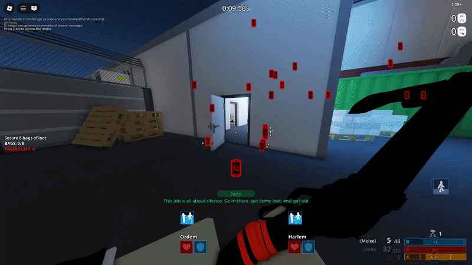

Hold down the sentry placement right after you enter through the single door.

4. Loot weapons on the metal shelves if they are spawned.

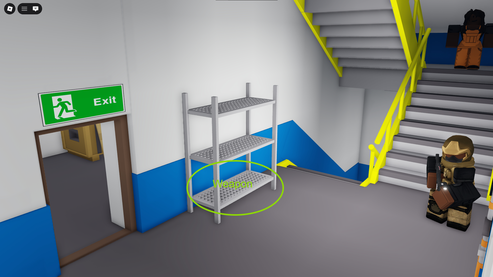

5. Loot (Money, Weapon and Bloxy Cola) on the metal shelves if they are spawned.

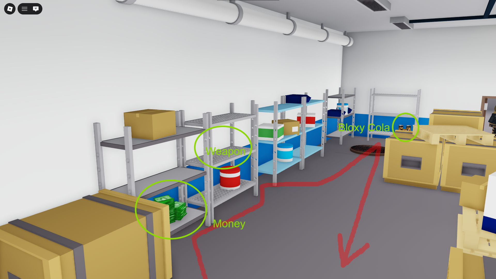

6. Throw everything you looted towards the exit door.

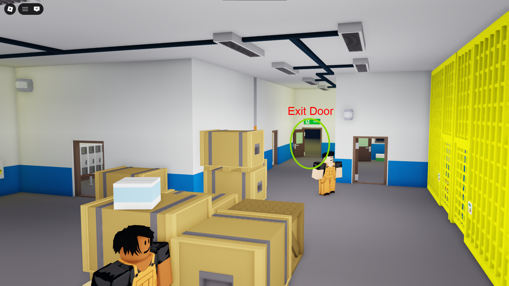

7. To start searching for keys you must check the docks guard first.

Important note: Key Guards CAN spawn anywhere in the map.
For each key you grab call-out "Yes!" by pressing your middle mouse button once (Scroll button).
If the keycard was found outside R4 will grab it. If R2 has the second one you will have to switch roles with R4 and continue opening red containers outside.

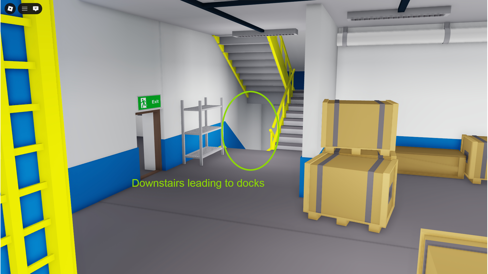
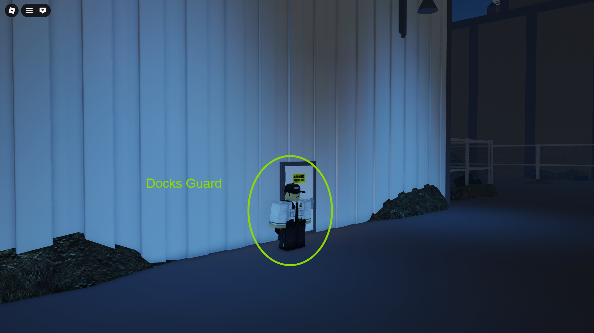
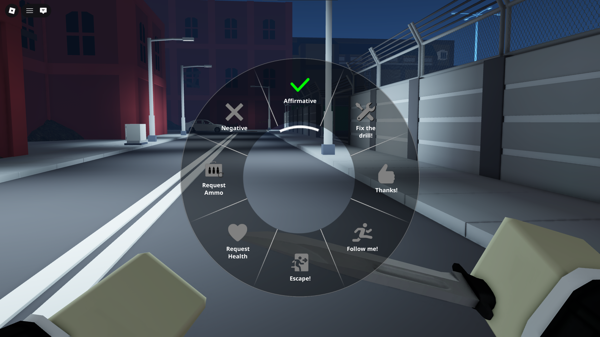

8. After both keycards are found, head towards the vault and only loot the top parts of the armor.

If R2 is not there to help you with the vault, you will have to loot the bottom parts as well.
If you are to loot both top and bottom parts of the armor, you'll have to throw 2 bags outside to the yellow circle spot shown below.

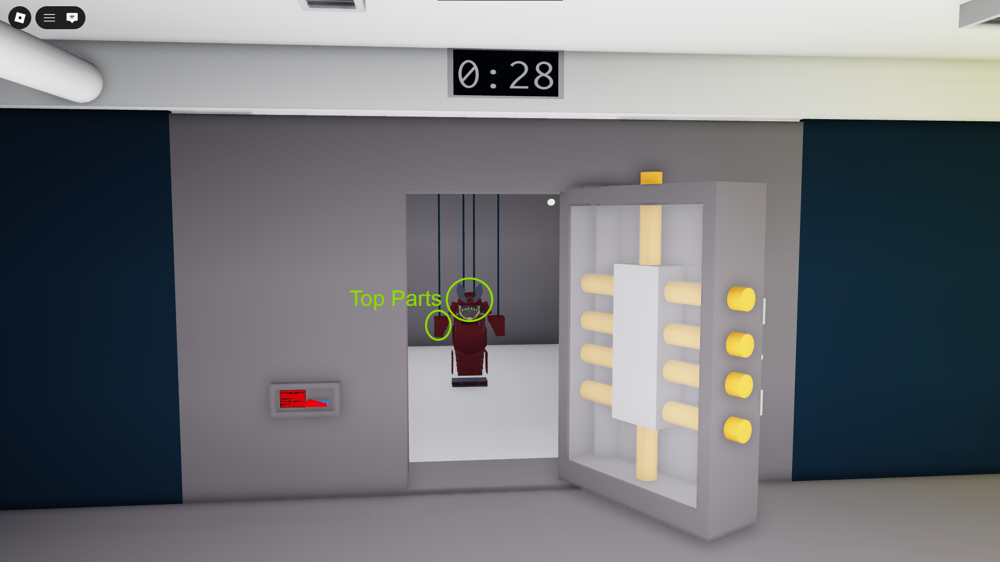
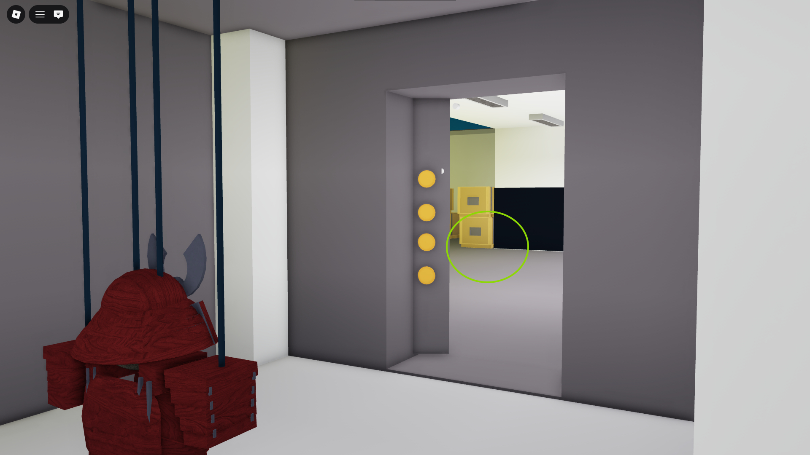

9. After looting the vault, carry all the bags towards the wall shown below (NOT THE GATE).

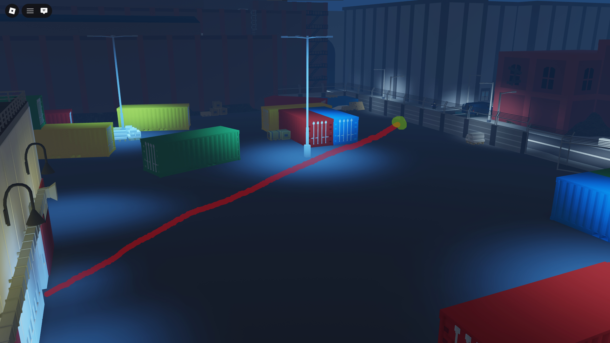

10. Once all the bags are in front of the wall, start throwing them over to the van like shown below.

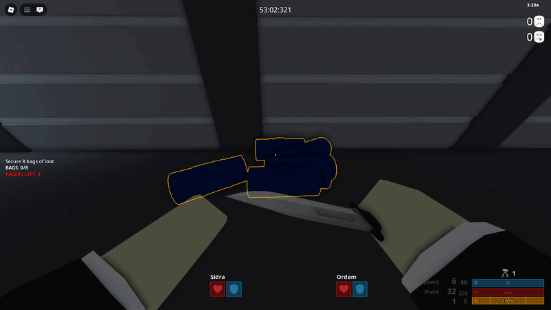

11. To jump over the fences like shown below, you must sprint towards the wall and spam jump while facing forward.

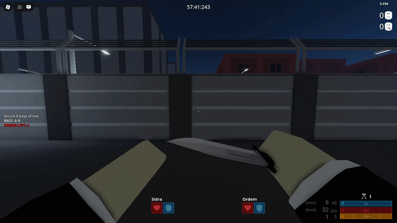
