# Sweepot

Sweepot is featured on all 3 versions of SSD

1. At the beginning, mask up, run forward, turn back, boost your teammates, run towards the corner, and use your molotov at the middle of the warehouse entrance.

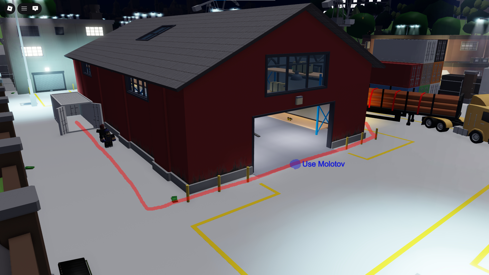

2. As you are running towards the water tank on a fork lift, first slide at the spot shown in the picture and then start holding down your ECM at the spot again shown in the picture.

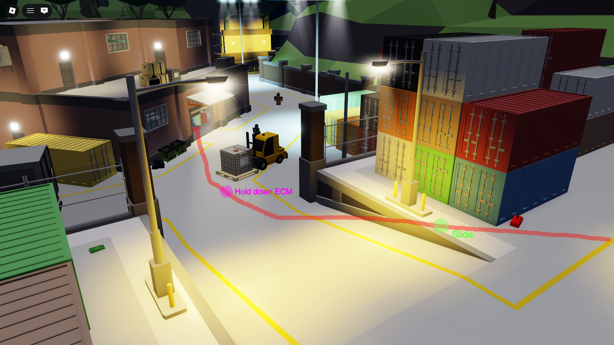

3. As you enter Transport (Warehouse) first kill the guard and grab your key. Second loot the "Weapon Loot on Barrels" if it spawned. Leave the Transport through the front right garage door.

Tip: If the "Weapon Loot" is spawned check around for your second and third key while interacting with looting it.

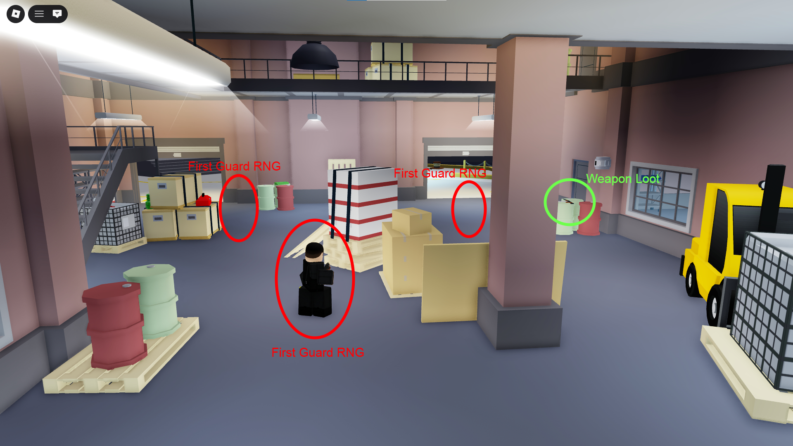

4. As you leave Transport (Warehouse) , turn around by the Staircase and kill the guard which has your Second Key.

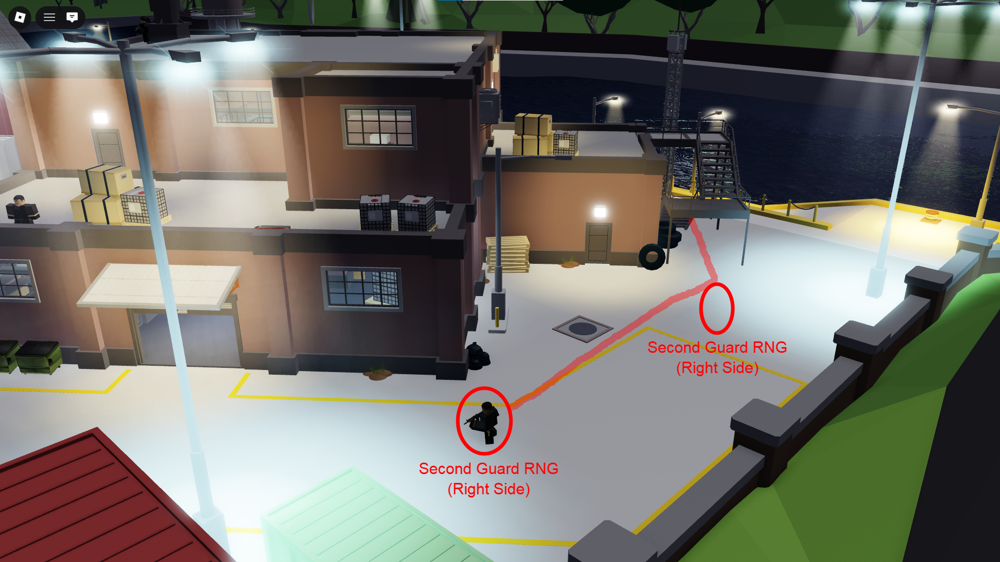

This guard could also spawn at the docks like shown in this second picture.

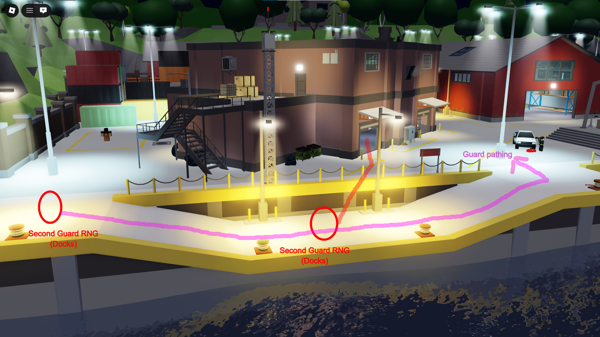

5. Your third key will be on this guard which roams around the (Far Docks & Goose). He will spawn in the circles shown below. He can roam in the whole line shown below.

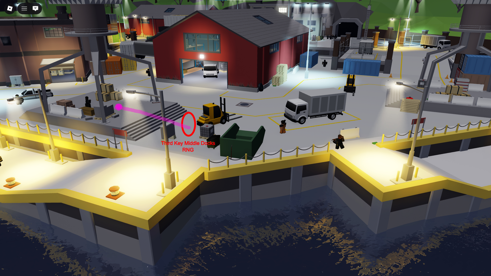
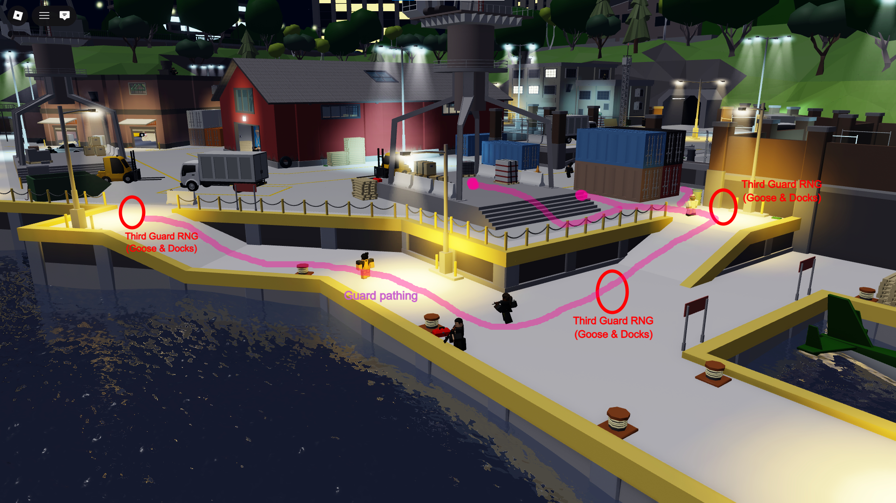

6. Timing of your second ECM placement is shown in the picture below, when you start holding down your ECM at the point below you will have your ECM placed right in front of the first garage door.

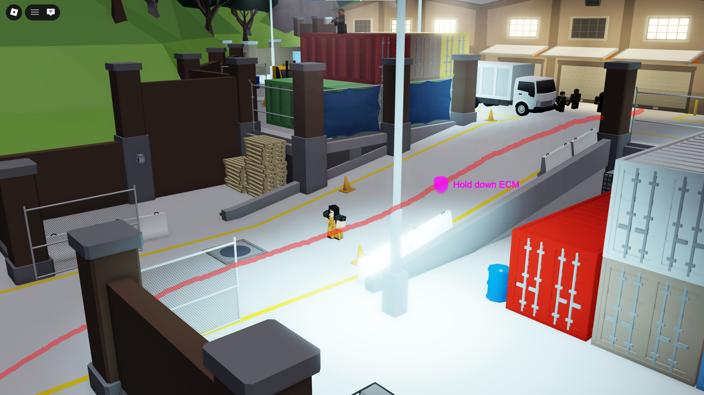

7. Proceed with opening your garages right to left. During this process follow the path of line and use the yellow points as where to stay for faster door opening.

Why yellow points? There's a delay between door swap's. You can stand on the yellow point and start moving to the left side (pressing A while facing the garage doors) as the interaction is around 80%.

This way you'll end up on the second door without losing your time on door swap delay because you started moving towards the left side as your interaction closes to an end.

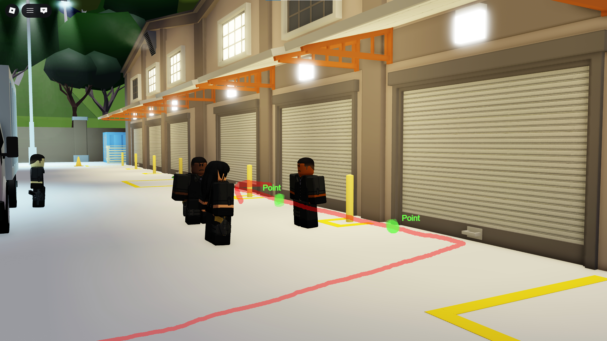
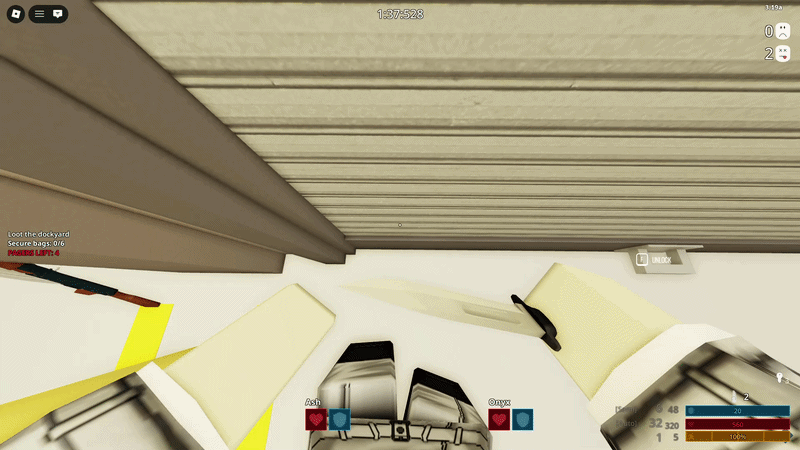

8. As you are looting your garages, throw the loot towards the blue burlap corner.

Make sure to juggle the bags thrown in your path by R4!

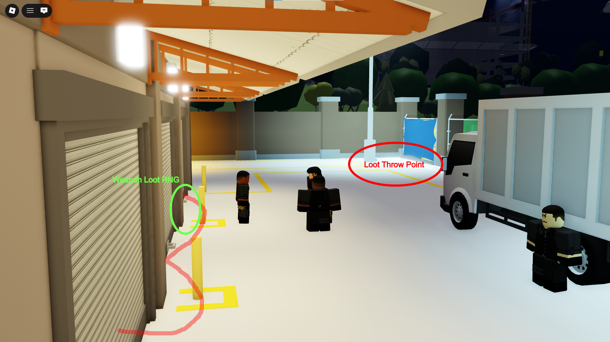

9. Throw the bags in the corner to escape over Blue Burlap like shown below.

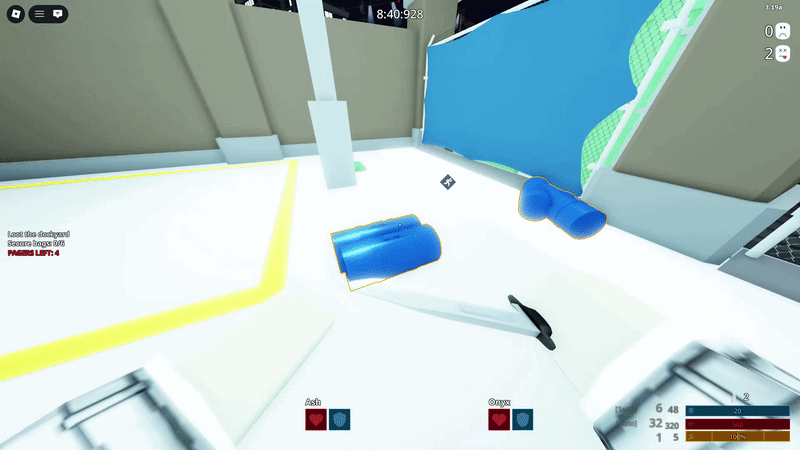

10. After you are done with throwing all the bags over to escape, use the street light skip for middle warehouse access like shown below.

11. Before making your way to the Middle Warehouse, make sure to check the corner crate RNG and loot it if R4 has not yet.

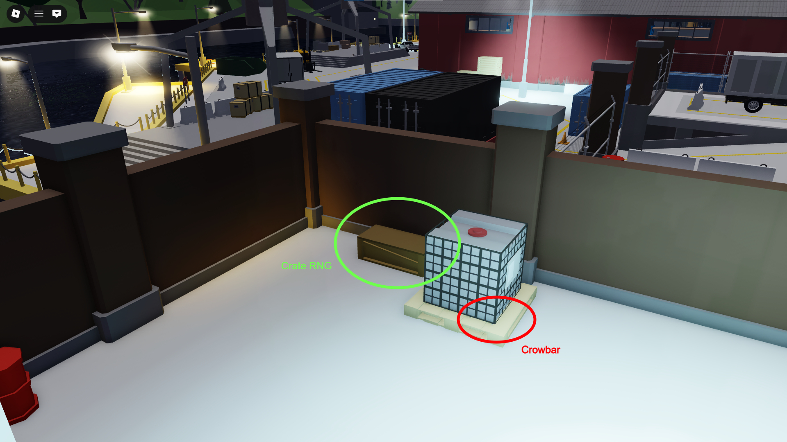

Spawns (RNG)

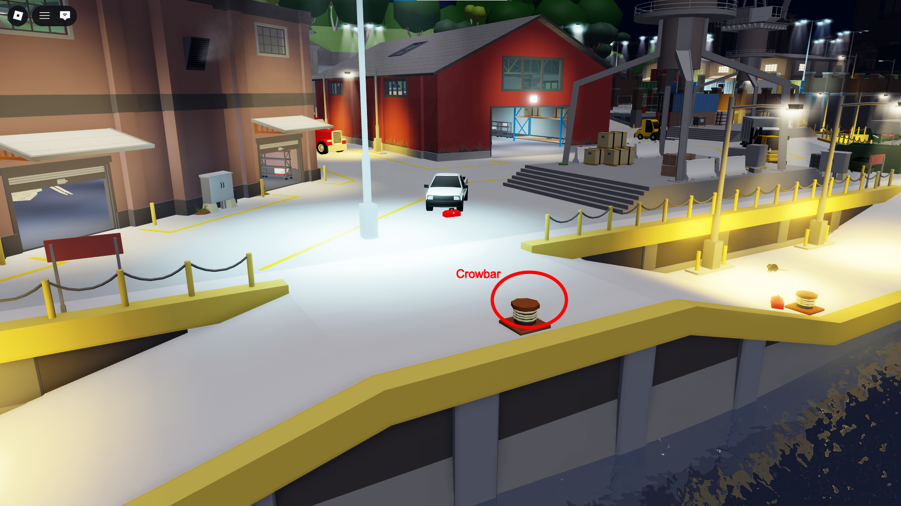
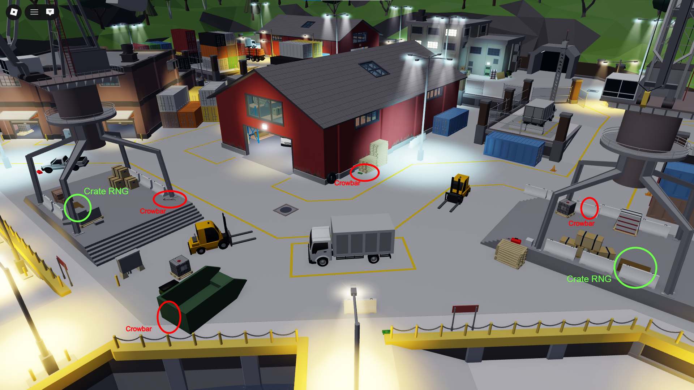
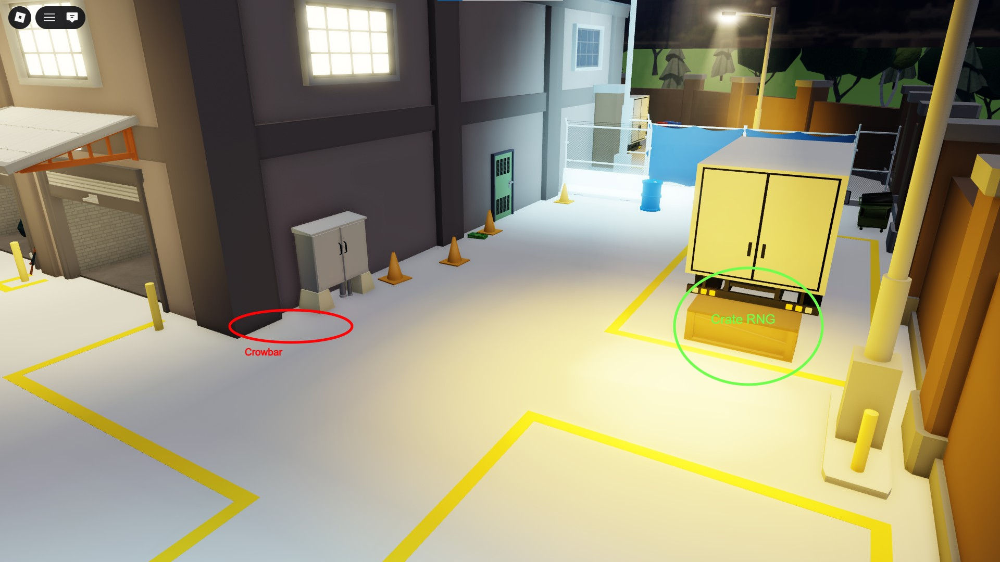
