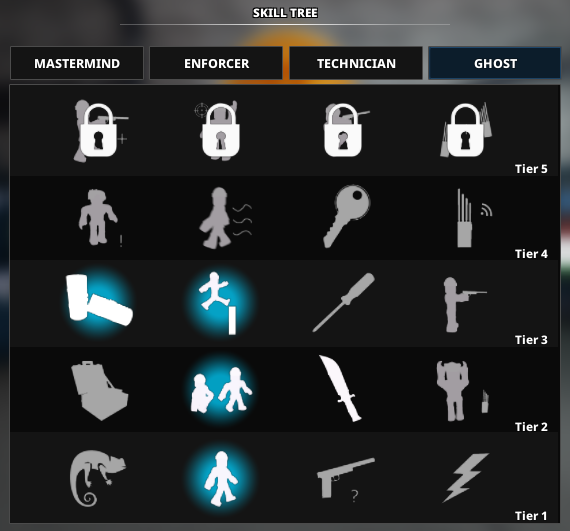
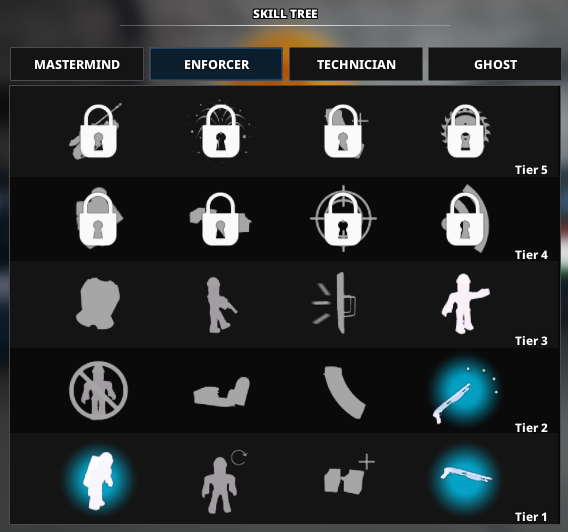
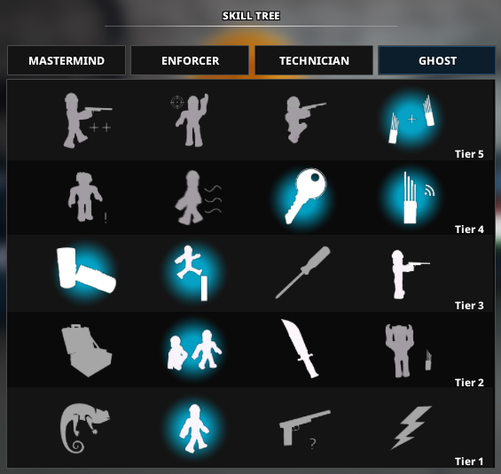
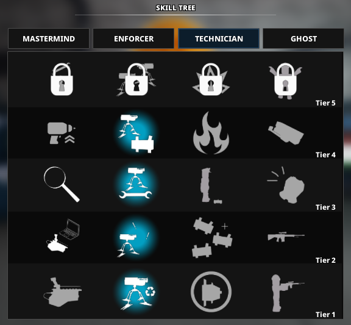

# Role 2

For video guides go [here](../resources.md)

## Loadout

- Primary: Breaker 12G with the “Butcher’s Axe” and the “Oil Filter” attachments.
- Secondary: M79 GL/TP-82 Sonaz with the “Interceptor” and “Self-Loading Barrel” attachments.
- Melee: Knife / Balisong Knife. Both are the same.
- Gadget: Molotov.
- Equipment: ECM Device. You can switch to Sentry in Shadow Raid if you do not have Jack of All Trades but don’t forget to change it back for Nightclub.
- Armor: Suit.
- Jack of All Trades (after skill break 2): Sentry.

## Skills

### Pre-Skills

before diamond store

### Skill Break 1

After Diamond Store / before Art Gallery

### Skill Break 2

After Art Gallery / before Sweepot

\
You can use any other skills as you wish as long as you follow these skill breaks\
NOTE: Do NOT use the “Leader” skill in the mastermind tree.
