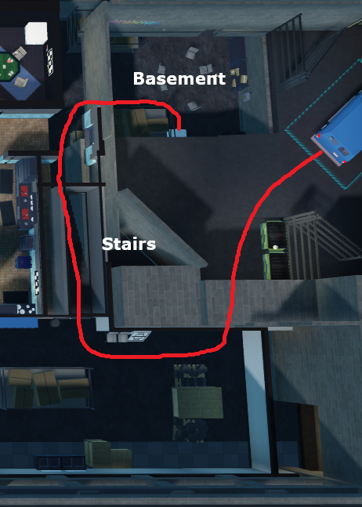
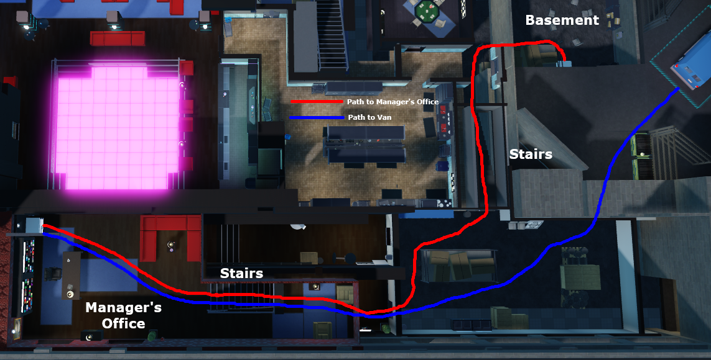

# Nightclub (NC)

Nightclub is featured on the “Booster/Gamepass” and “Booster and Gamepass” versions of SSD.

IMPORTANT: first nightclub will be full sweep, meaning you grab whatever is in the safe (you grab cola or jewelry if not cash)

1. Enter the building, either through the front entrance or jumping onto the balcony using the Coach Gun.

2. Run past the dance floor and into the back area, then enter the basement and open the safe (route shown below).

3. Two Variants:
    a. If there is cash in the safe, use the “Yes!” callout, then bag the middle cash stack and the left cash stack, if no one has reached your safe yet by the time you finish bagging both cash stacks, then throw them near the stairs for them to pick up and bag the remaining stack.

        

    b. If there isn’t cash in your safe, read the chat to see who called out “Yes!”; if r1 called it, then go to their safe (manager’s office), if r3 called it and r1 didn’t, then go to r3’s safe (poker room). Bag a cash stack from the safe, if you got there late then grab the bags they threw instead.

        
        

4. Bring your bags to the van, throw them in, and step inside to escape.

---

Good luck on your application!

It’s heavily recommended that you try practicing your pathing for each heist before doing your first rotation, as well as learning the map layouts if you are very new to the game. If you have any questions you can ask in the [help channel](https://discord.com/channels/1320286115449671680/1322274671382499481) in the Discord server.
