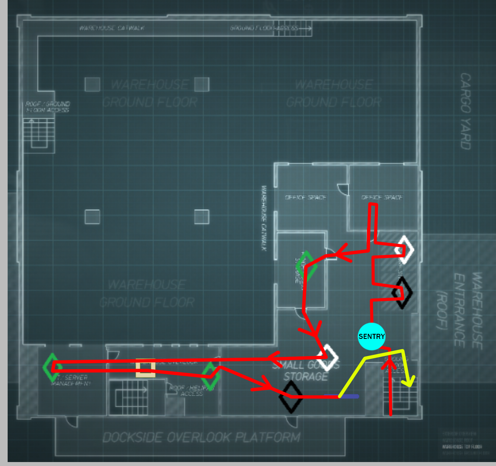
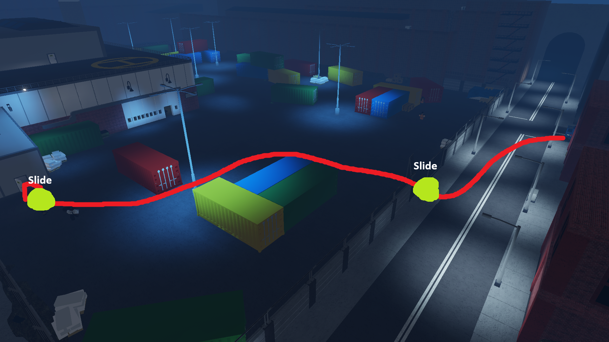
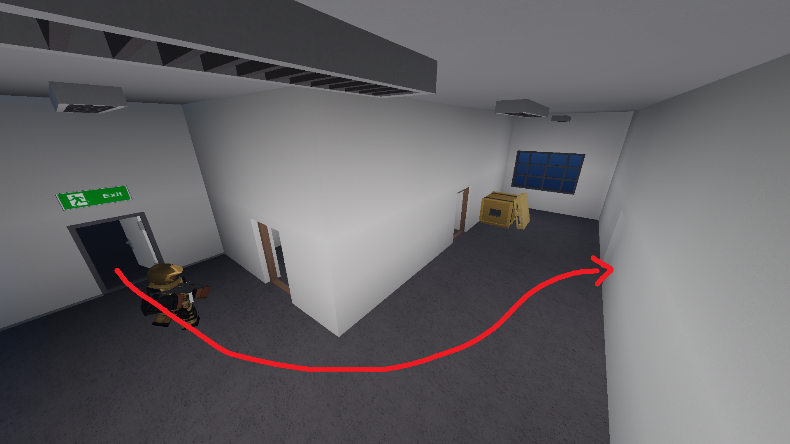
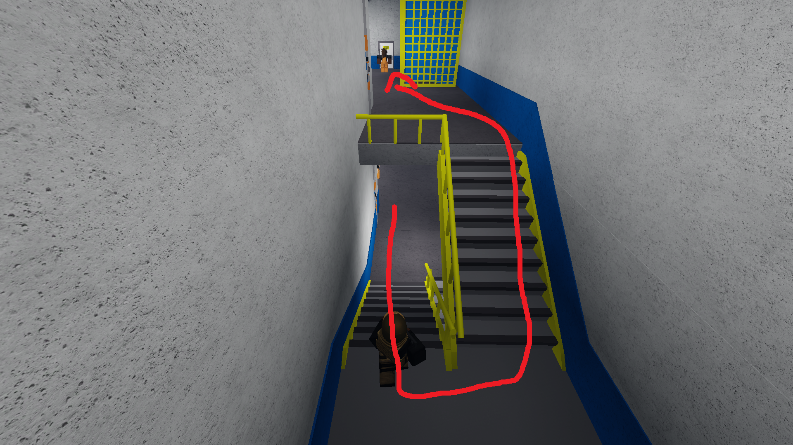
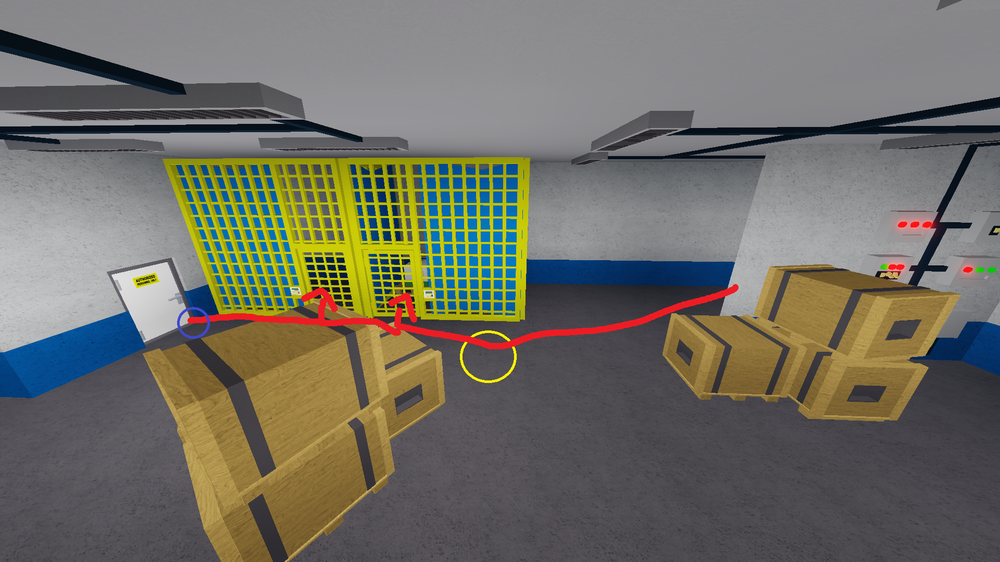

# Shadow Raid (SR)

Shadow Raid is featured on the “No Gamepass, No Booster” and “Booster/Gamepass” versions of SSD.

1. Mask up, charisma your teammates, then molly yourself for second wind while following the red path

2. After going upstairs, place your sentry at the yellow circle, and check inside the cages. If there is loot inside, open them and grab the loot. Then kick open the door to the camera room to check if the cam operator has a keycard, your sentry should kill him

