# Sweepot

Sweepot is featured on all 3 versions of SSD.\
**You will be ECMing at 0:50, 1:10**

1. Mask up, sprint, charisma your teammates and follow the red path (yellow line shows alternative, advanced path using coach/sonaz gun)

2. After entering the transport building, you will be looking for various key spawns. You will grab two keys. Key spawns (circled in red) are shown in the pictures below:

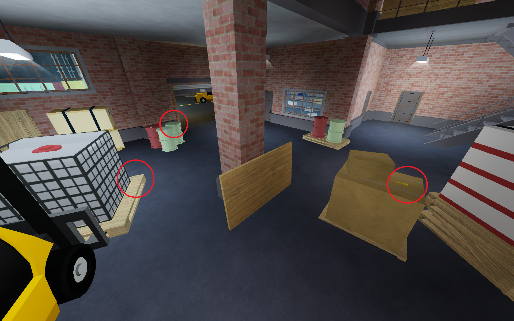
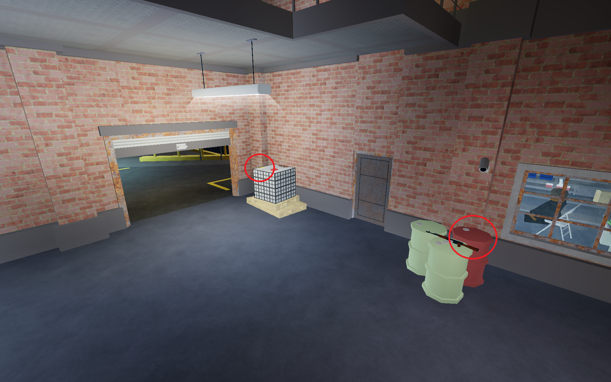
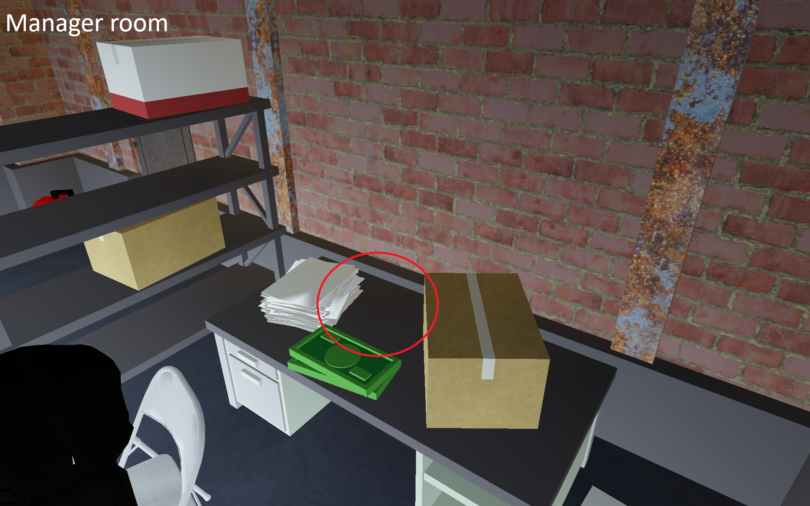
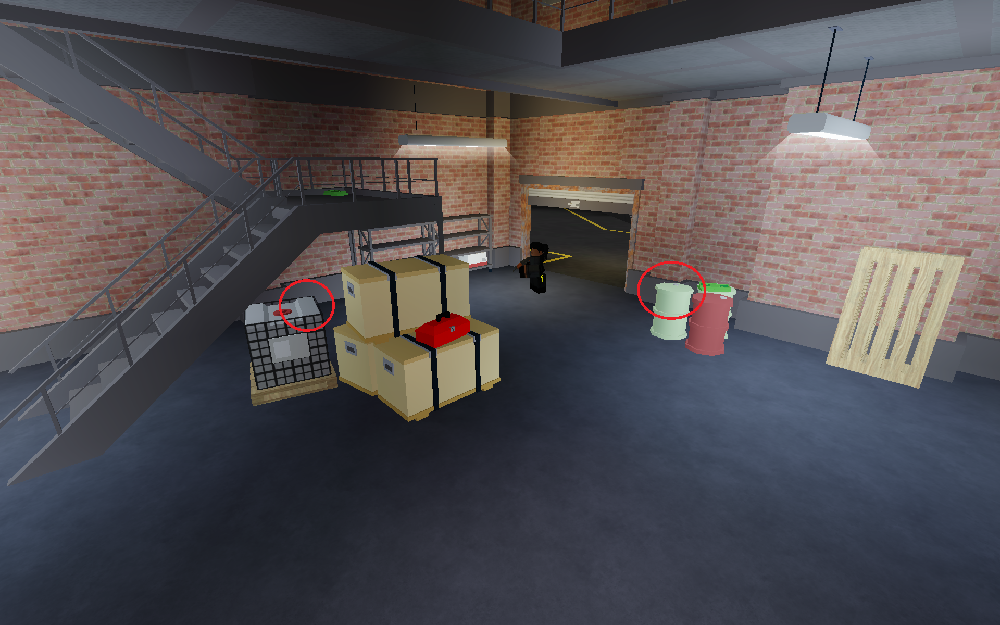

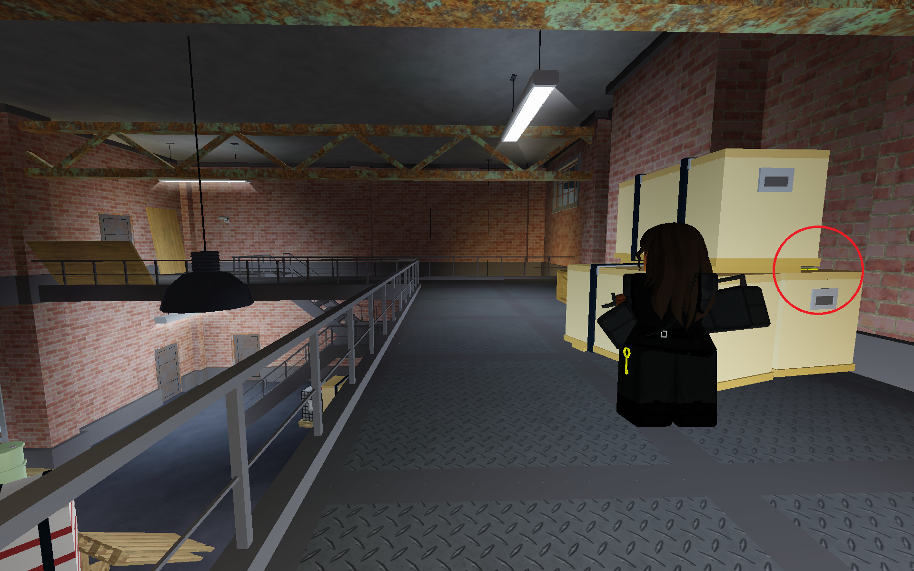
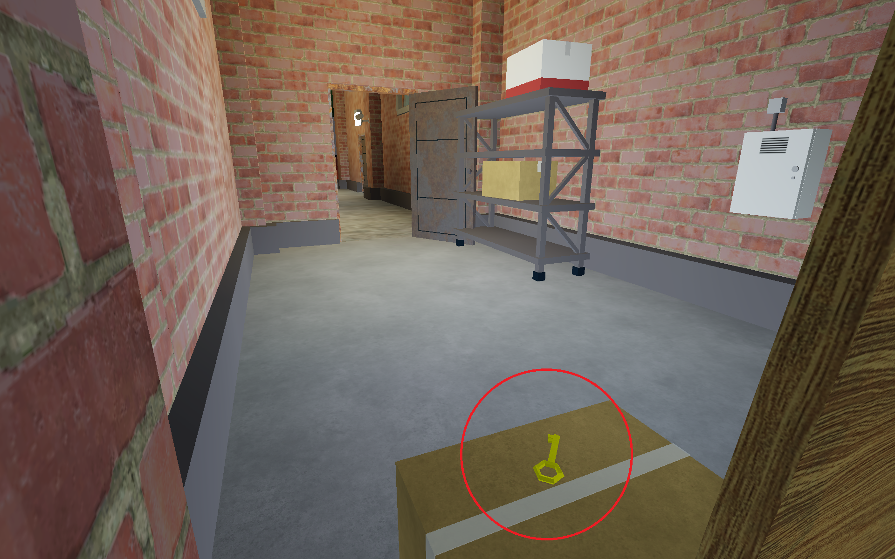

!!! info "Note"

    remembering all of these key spawns can be pretty difficult, it’s highly recommended that you practice key finding pathing until you develop consistency. You will also loot key spawns in that order

If you grab your two ground keys before finish key find pathing, you can then stop searching for keys)

Also look out for potential loot spawns (loot you will grab will be circled in green)

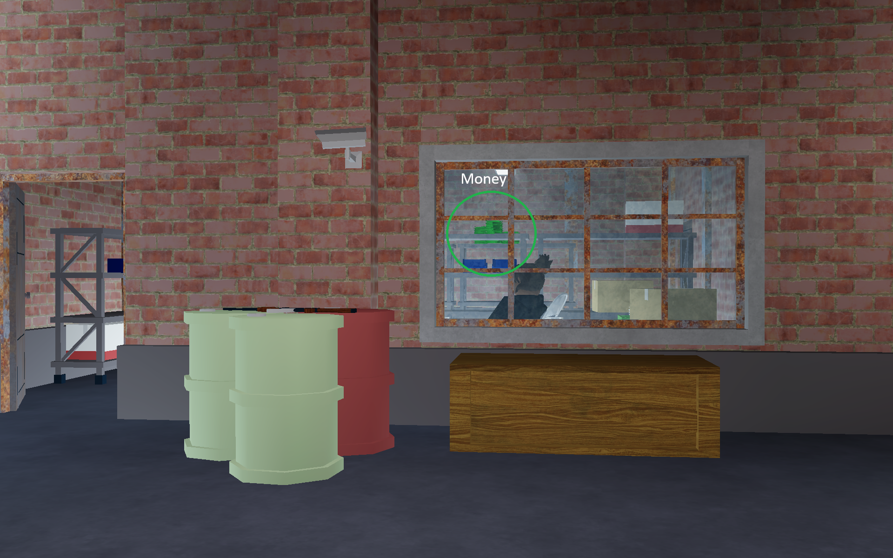
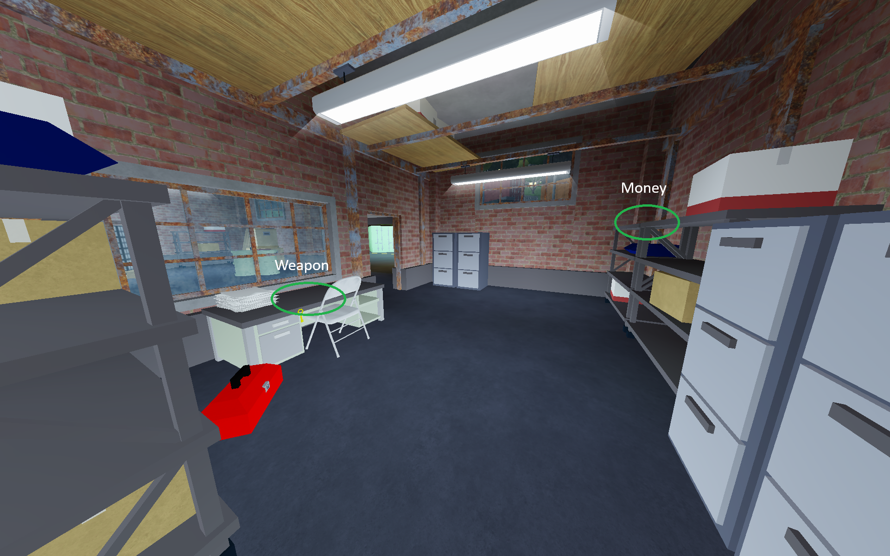

3. After finishing looting downstairs, make your way upstairs and kill the upstairs guard. Go to upstairs key spawns if required.

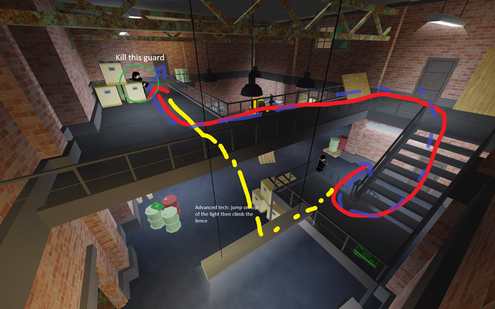

!!! tip
    Look out for the exclamation marks on top of the guard. This can help you pinpoint the exact location of the guard. The guard also has a chance to go outside through upstairs or downstairs (Blue path shows potential guard pathing)

4. After looting all your keys and loot spawns, you will exit transport and make your way to 3g. Make sure to constantly slide and maintain sw uptake when moving distances.

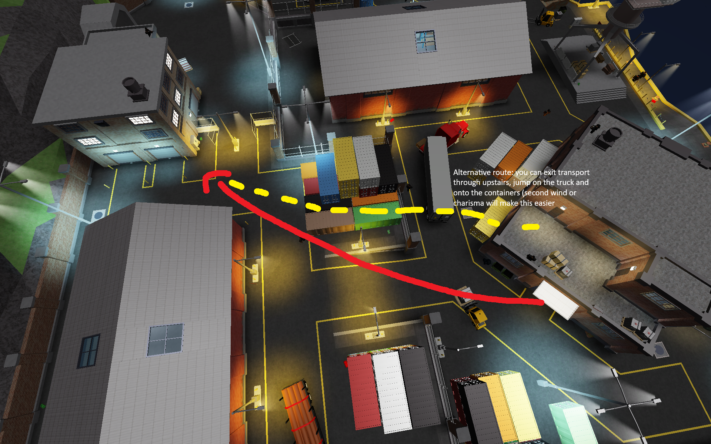

(Alternative, faster route shown by yellow line) If you’re upstairs, you can also take this path:

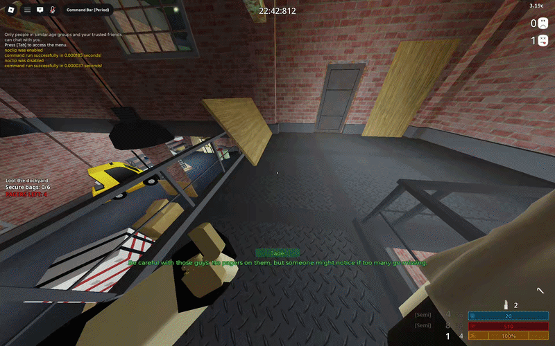

5. At 3g, you will start by opening the garage from right to left, then loot from left to right, shown by the red path.

After looting those garages, follow the green path, loot the last garage and proceed to move bags

!!! info "Note"

    It is important to keep track of the timer to know when you will ECM. Typically at 3g, you will place your first ECM then, at 50s, so be aware of that

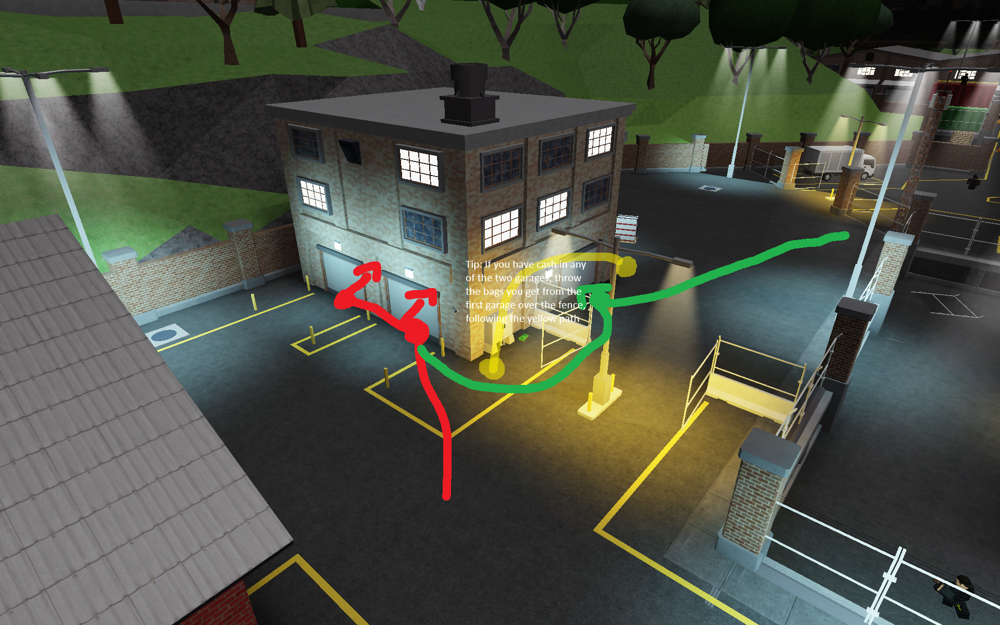

6. Move the bags towards the fence, and throw the bags over the fence and onto the slope, shown in the picture below. Make sure that no bags fall into the green zone as it can really screw your bag moving.

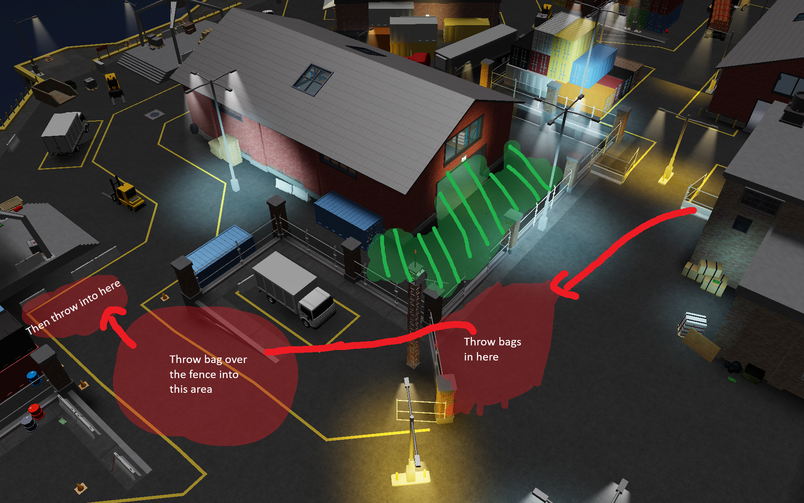

7. Finally, move the bags towards the red circle, then into the escape zone. Once finished, if r3 is still moving their bags, help them move their bags towards escape.

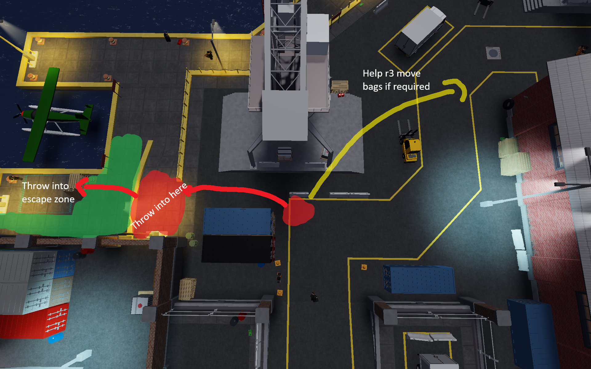
