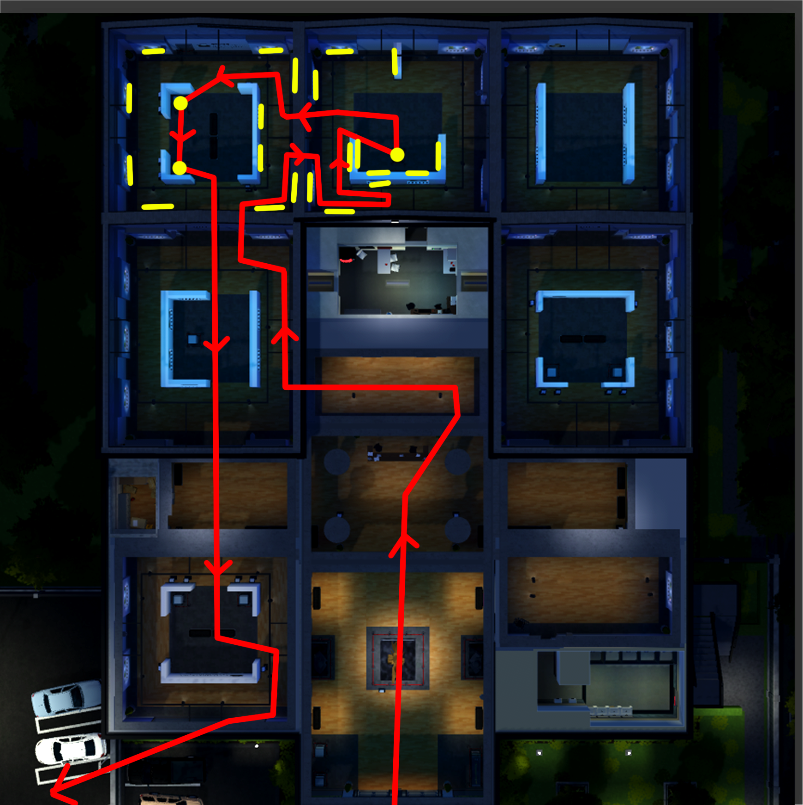
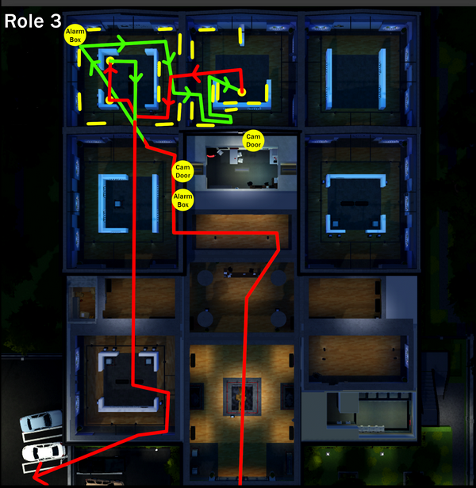
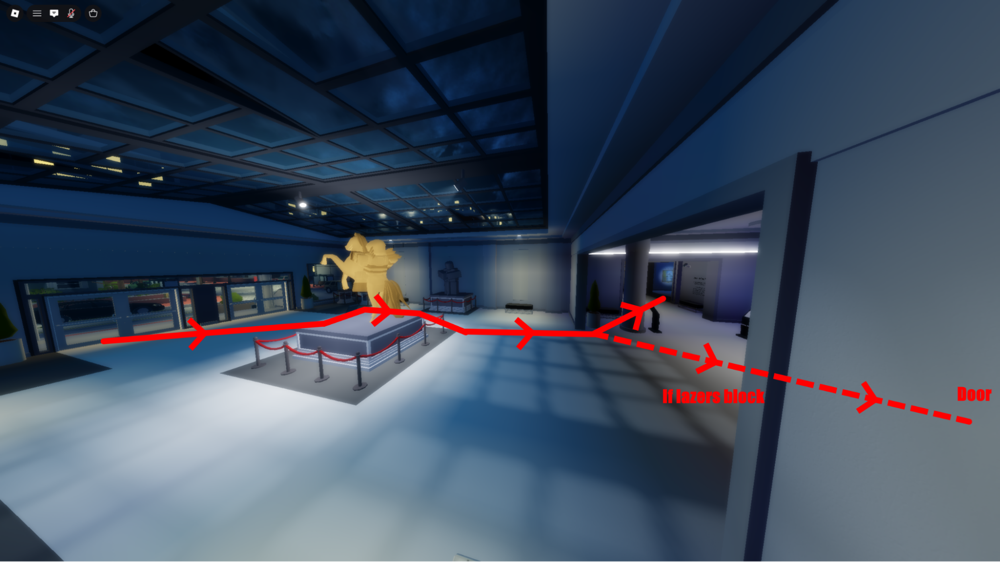
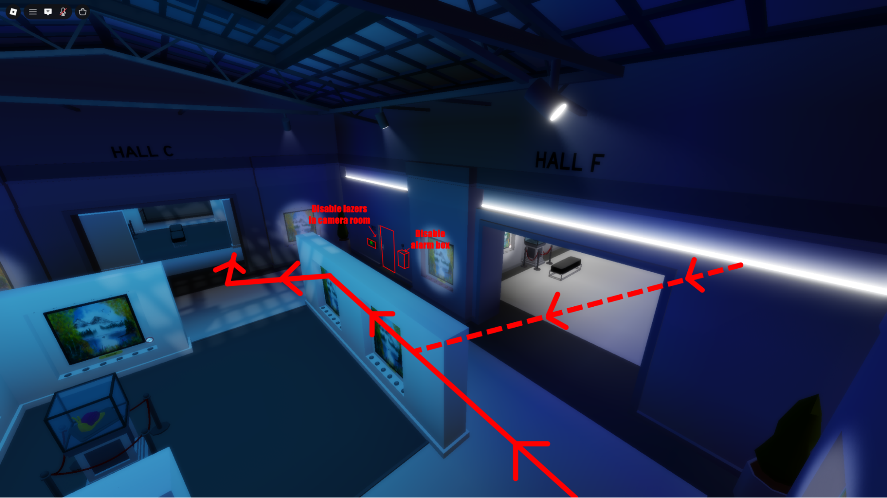
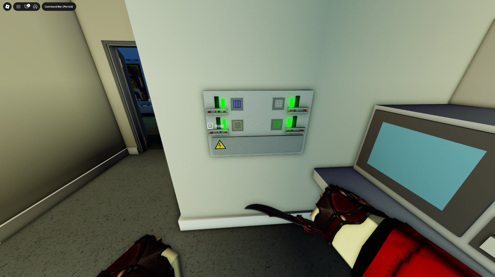
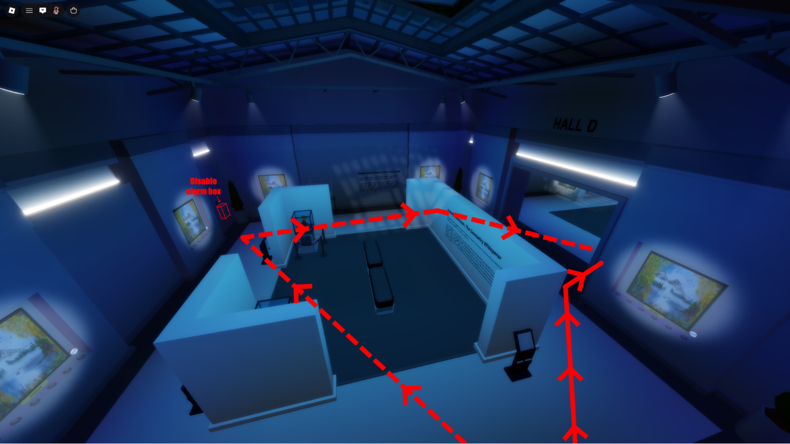
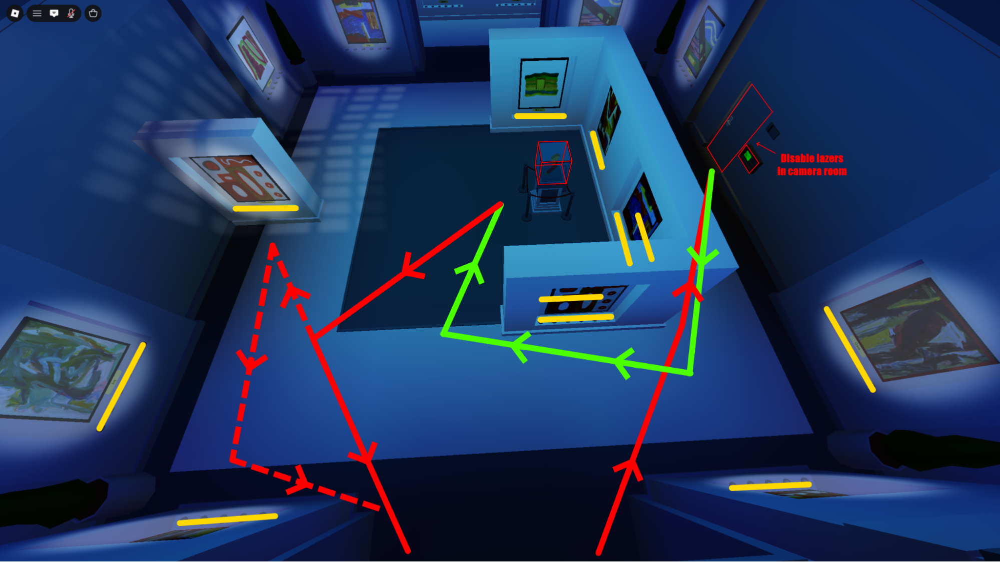
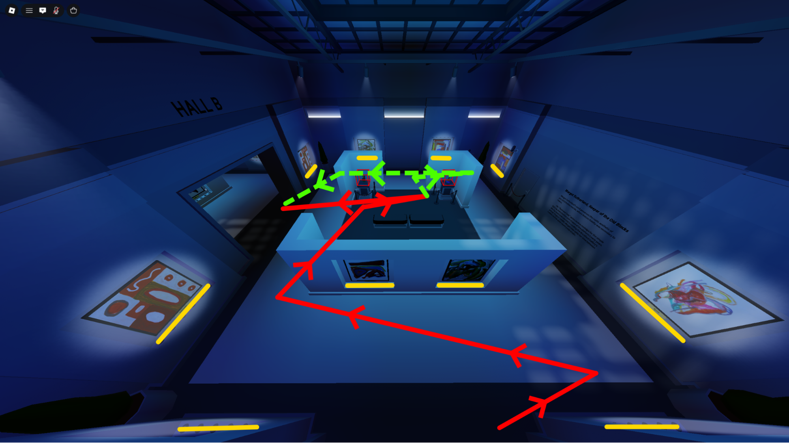
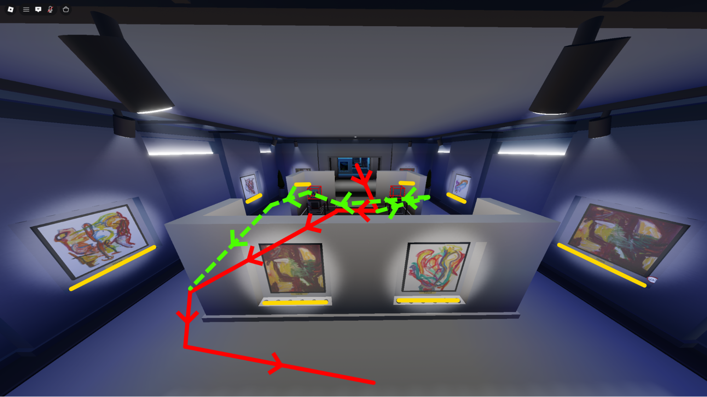
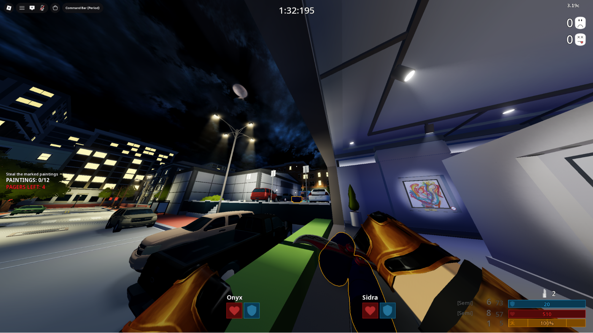

---
tags:
    - SSD
    - Role 3
    - No Booster, No Gamepass
    - Booster/Gamepass
---

# Art Gallery (AG)

!!! ecm
    at **1:10** on the timer

=== "Default"
    

=== "Top-left Alarm"
    

1. SW and enter the gallery

    

2. Run through the middle left room, disable the alarm and lasers if they spawn

    
    

3. Run through the top left room and disable alarm if it spawns

    

4. Disable lasers if they spawn, loot these paintings and the statue

    

5. Loot all paintings and statues in the top left room

    

6. Move all bags to the bottom left room.

    !!! callout
        Quickchat "Yes!" to signal that you are looting the bottom left room statues and paintings.
        If Yes! has already been called, skip straight to moving bags.

    

7. Secure all bags into the van

    
