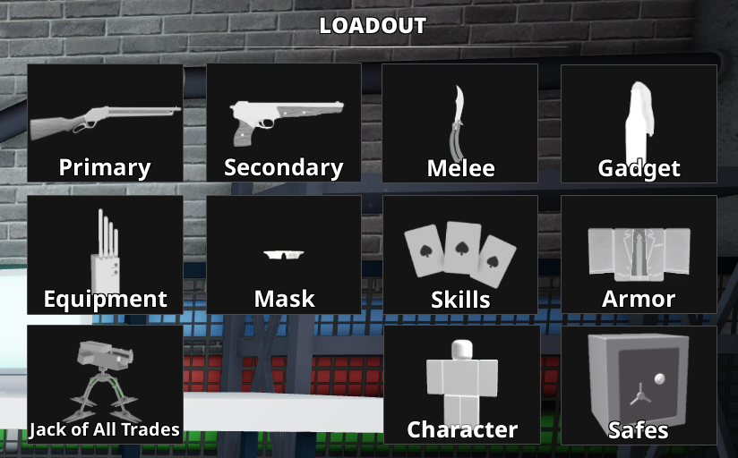
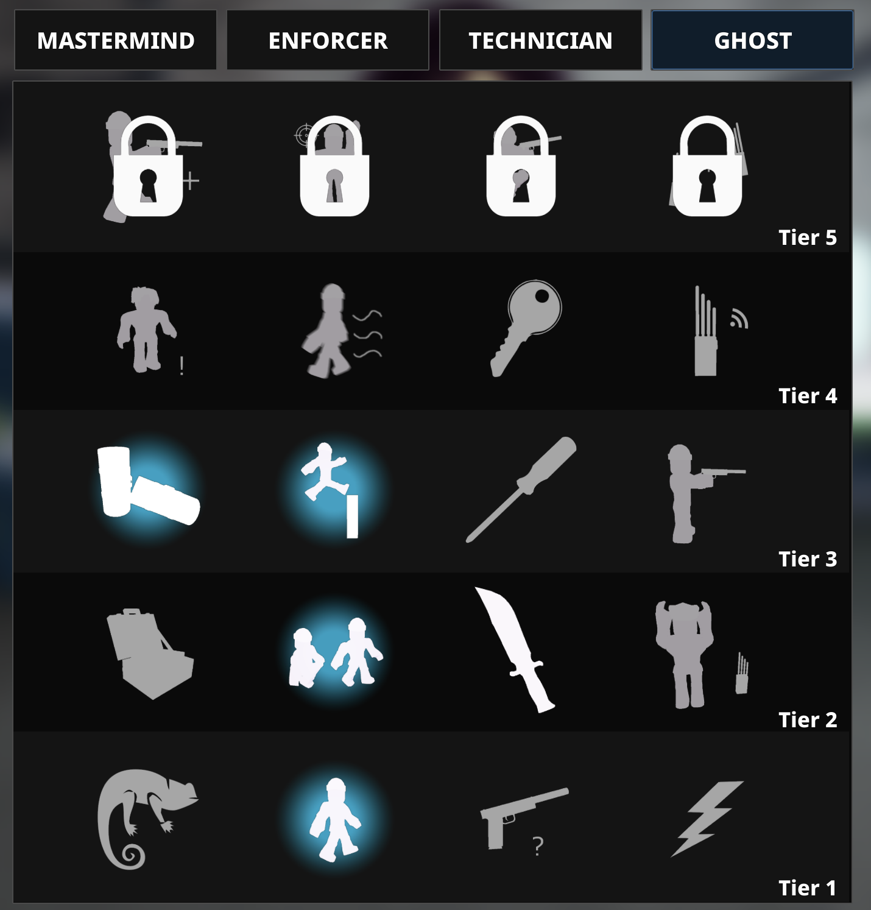
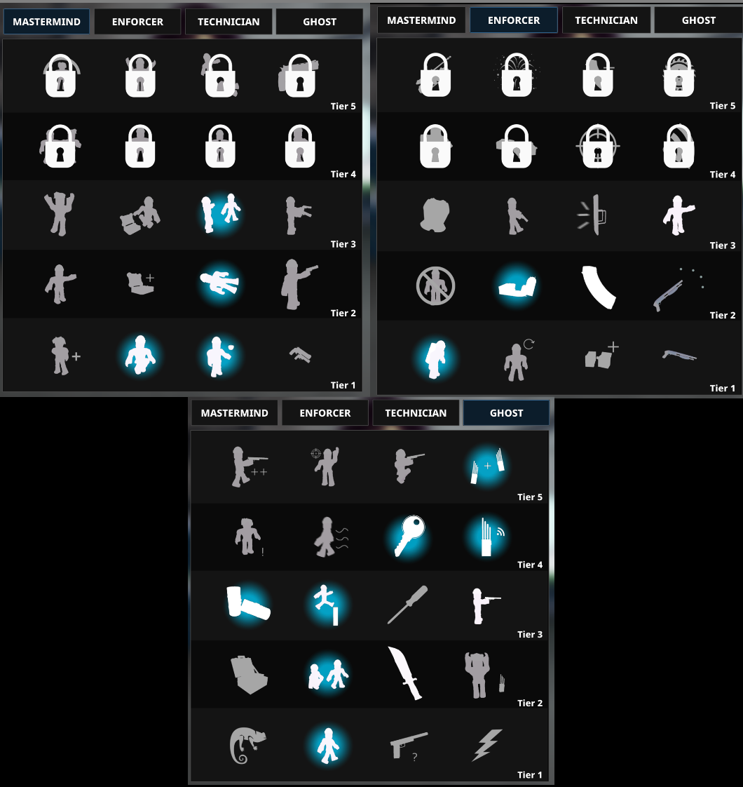
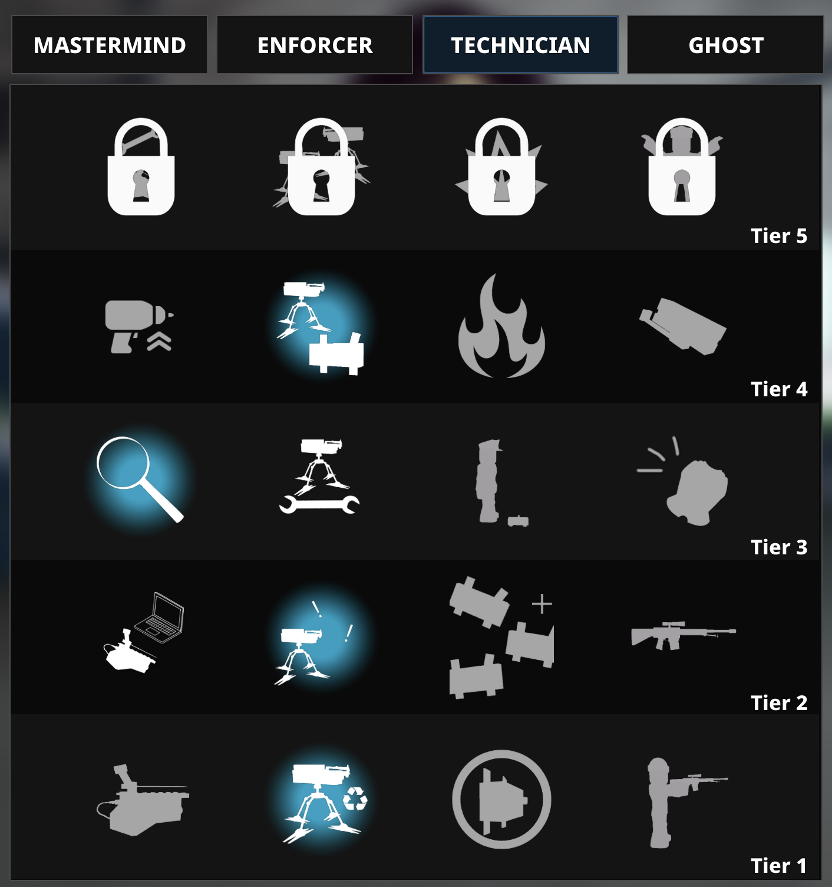
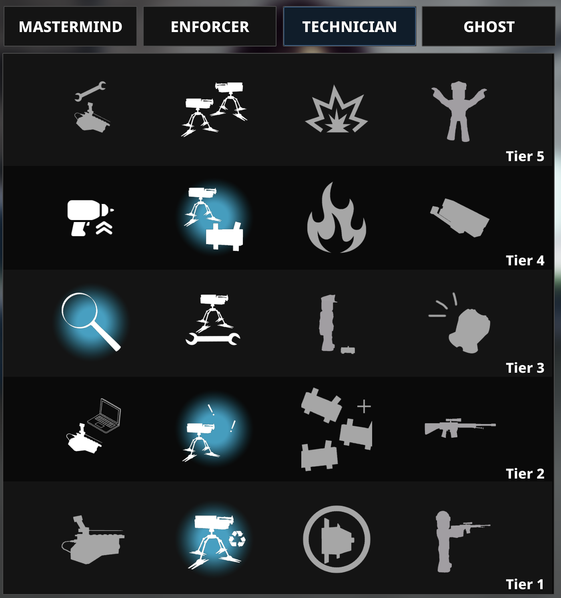

# Role 3

## Loadout

Primary: Breaker 12G\
Attachments: Oil Filter & Butcher’s Axe

Secondary: TP-82 Sonaz\
Attachments: Interceptor & Self-Loading Barrel

Gadget: Molotov

Armour: Suit

Equipment: ECM Device (Art Gallery, Sweepot, Nightclub), Sentry Gun (Shadow Raid)\
Jack of All Trades Extra Equipment: Sentry Gun (Depot, optional but highly recommended)

## Skilling

### Pre-skills

These are the skills you get before starting the first heist

### Skill Break 1

These are the skills you get when you return to the lobby to change heists for the first time

### Skill Break 2

These are the skills you get when you return to the lobby to change heists for the second time

### Skill Break 3

These are the skills you get when you return to the lobby to change heists for the third time.\
You may be able to combine skill break 2&3 if you have an xp boost/xp gamepass.

