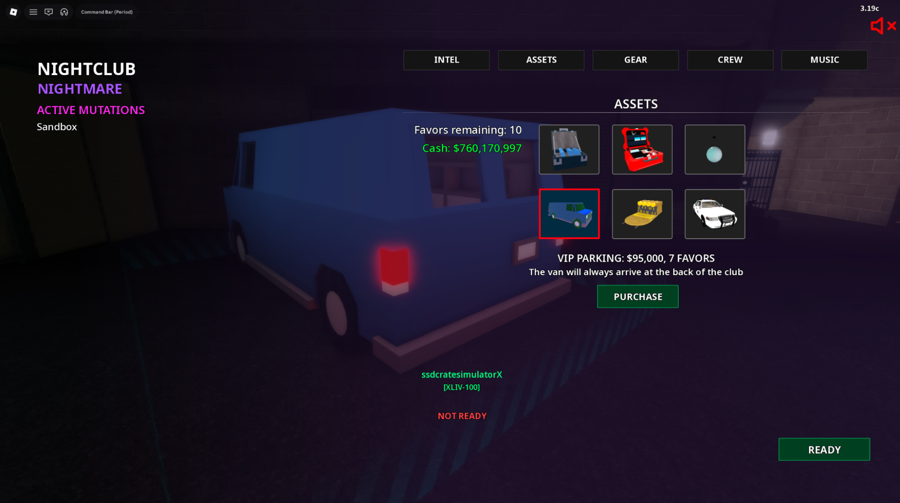
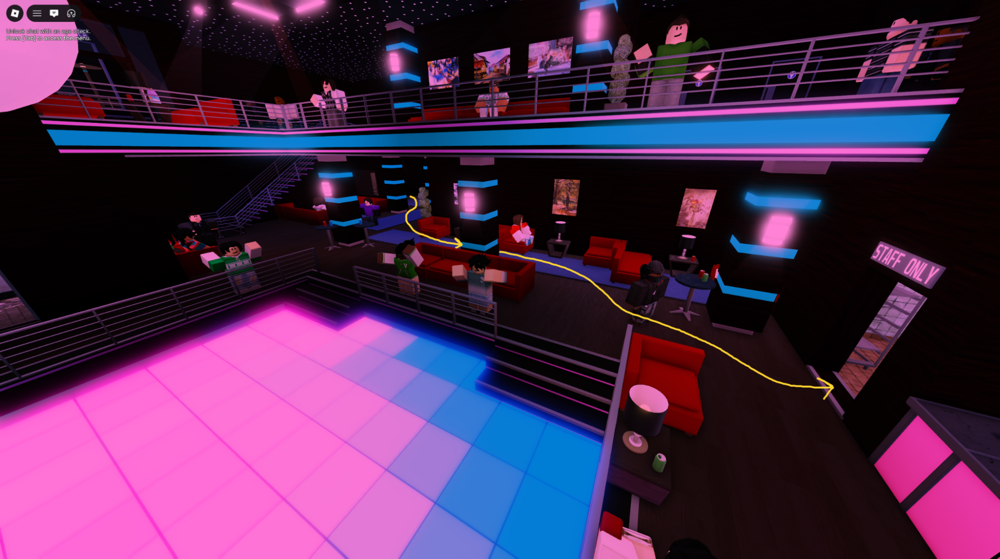
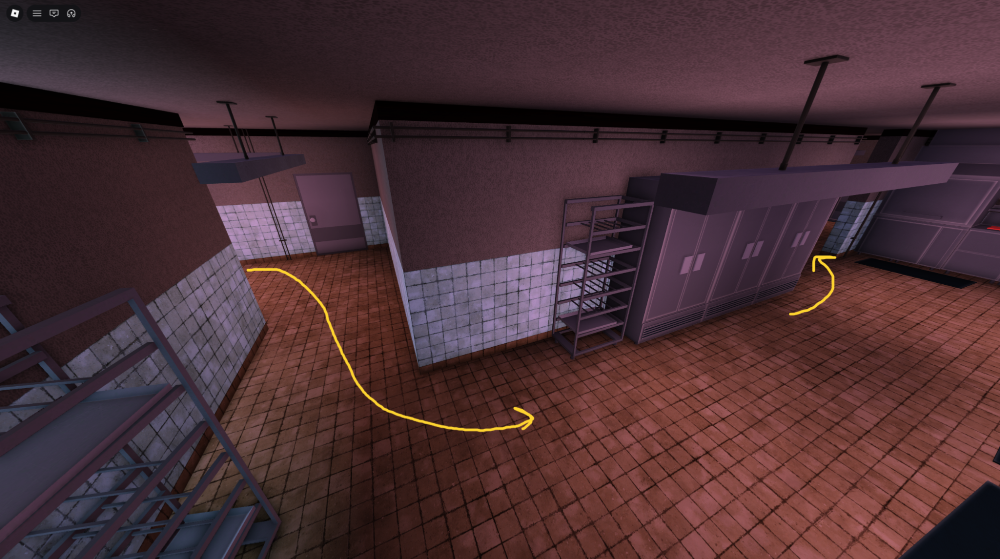
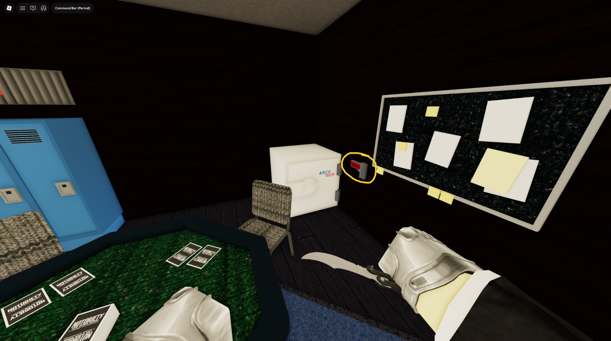
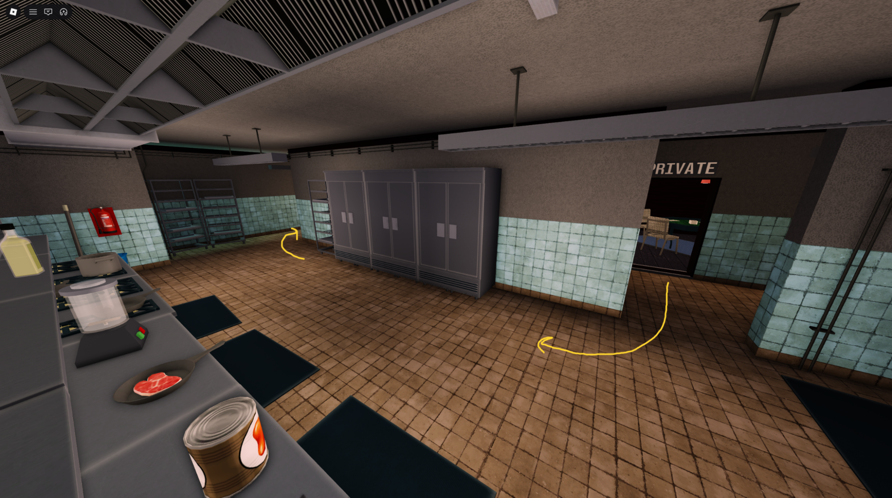
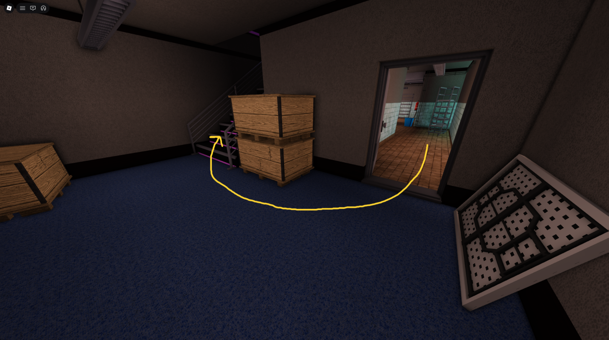
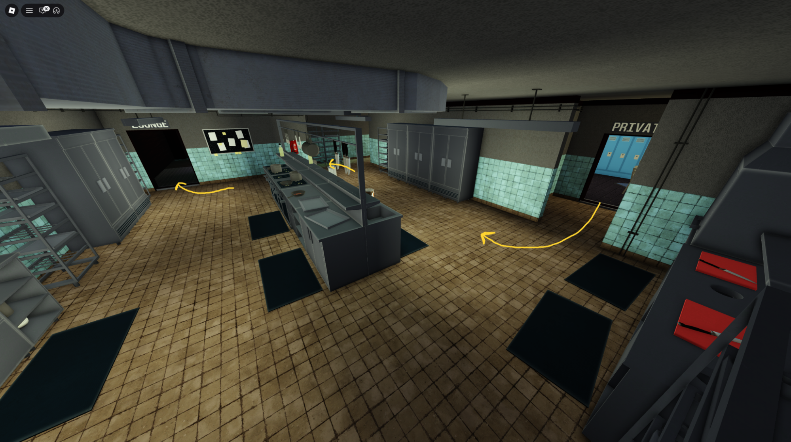
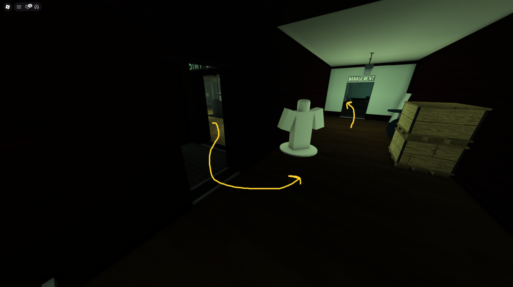
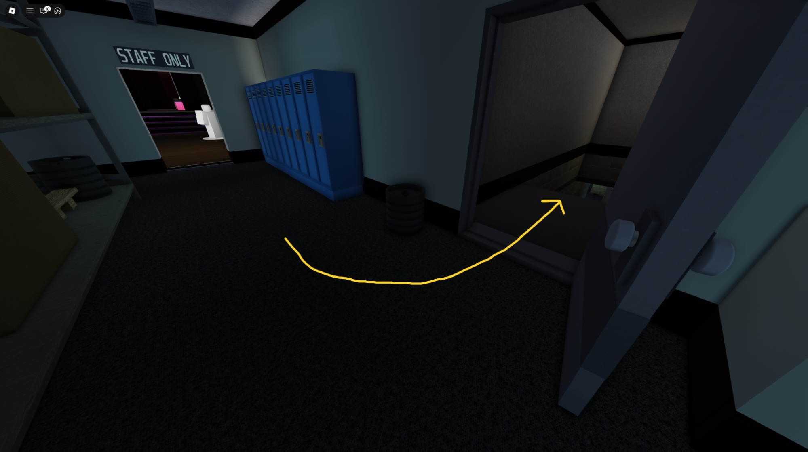
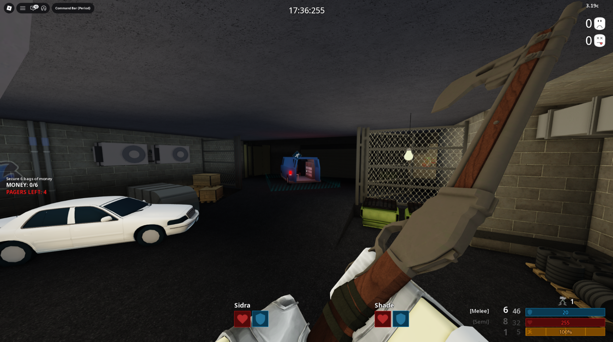

# Nightclub (NC)

Nightclub is featured on the “Booster/Gamepass” and “Booster and Gamepass” versions of SSD

IMPORTANT: Make sure the “VIP PARKING” asset has been bought to ensure the van spawns at the back of the nightclub

1. Enter the nightclub through the main entrance and navigate to the poker room

2. Open the safe with an ECM. If there is cash inside, quickchat “Yes” and bag the 2 leftmost bags.

    Someone should arrive to bag your 3rd cash but if they are not at your safe by the time you have bagged both cash, throw your bags to the poker room entrance and bag the third.

    If it is cola/jewlery, bag it in full sweep, but leave it in minimum.

3. If you do not have cash but r4 has cash, go to their safe and bag 1 cash or move the cash they throw behind them

4. If both you and r4 does not have cash, help r2 move their bags

5. Secure bags into the van and escape

