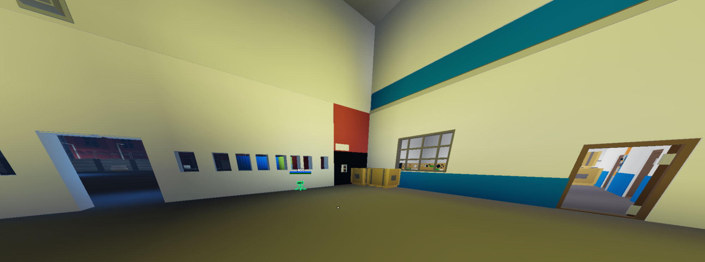
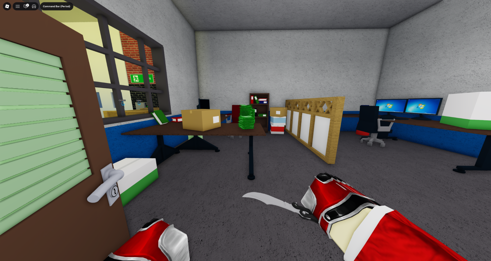
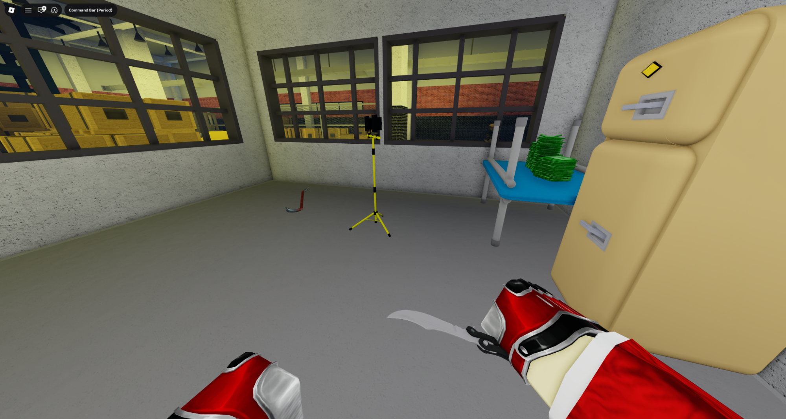
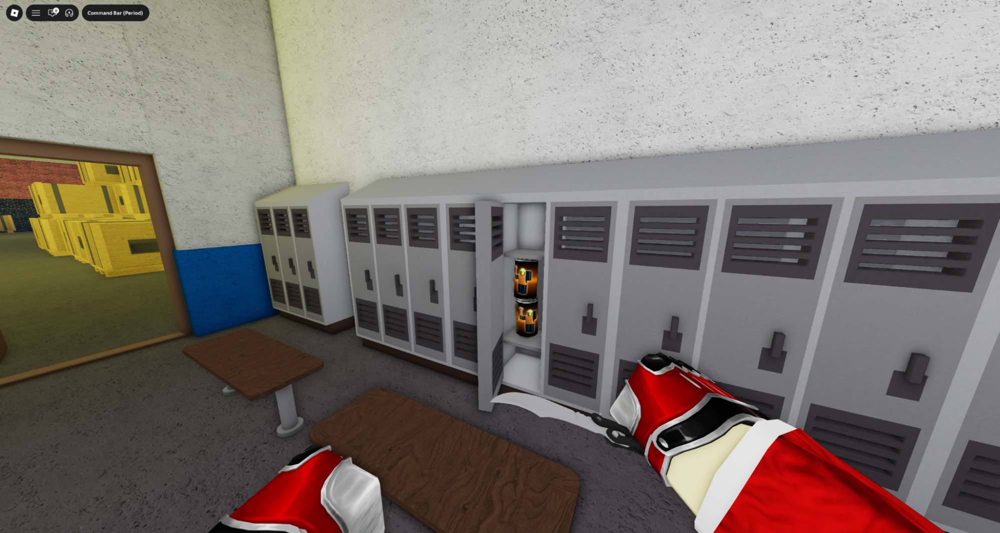
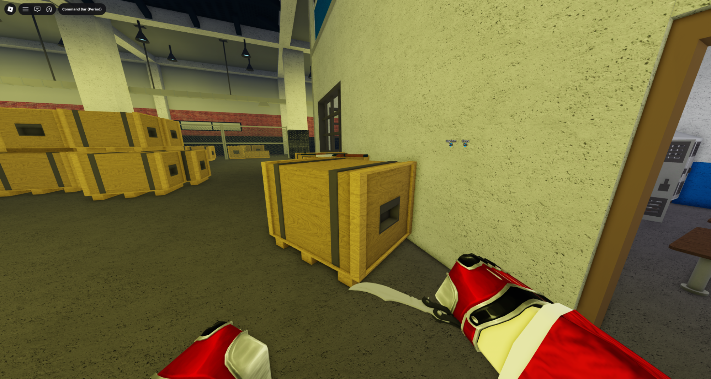
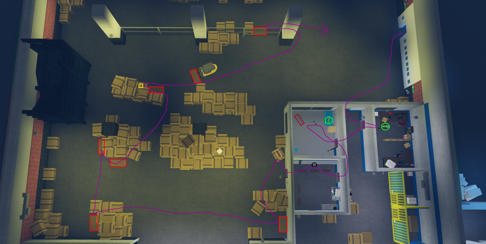
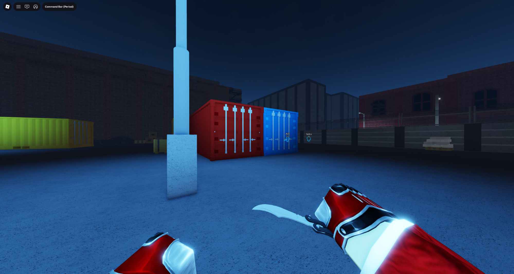
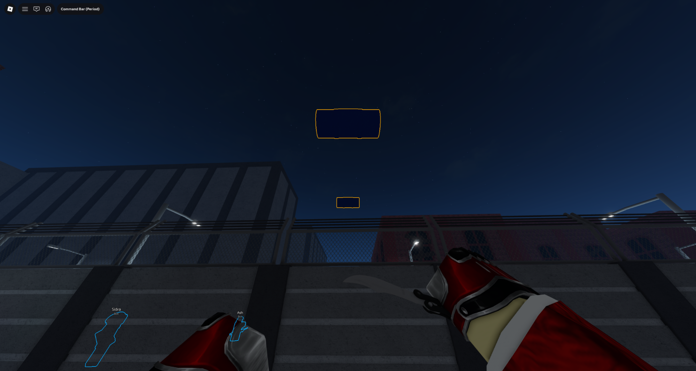

  Role 3
  SSD
  No Gamepass, No Booster
  Gamepass/Booster

# Shadow Raid (SR)

1. Enter the warehouse through the right entrance and place a sentry to the left of the entrance

    !!! warning
        The sentry must not have line of sight outside

    

2. Check the office to bag the cash

    

3. Take the crowbar from the storage room and bag the cash

    

4. Bag the cola in the locker room

    

5. Loot the weapons on the large box, place your 2nd sentry in this area

    

6. Loot all crates and grab the gold bar in the main warehouse section in a clockwise direction

    

7. Loot this red container if it has not been looted already

    

8. Secure the bags by throwing them over this wall

    
