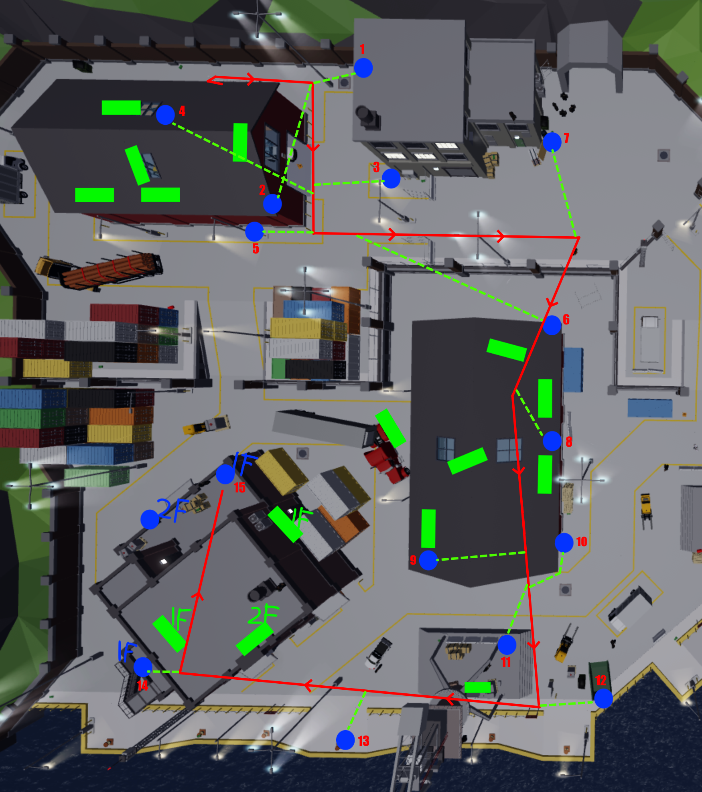
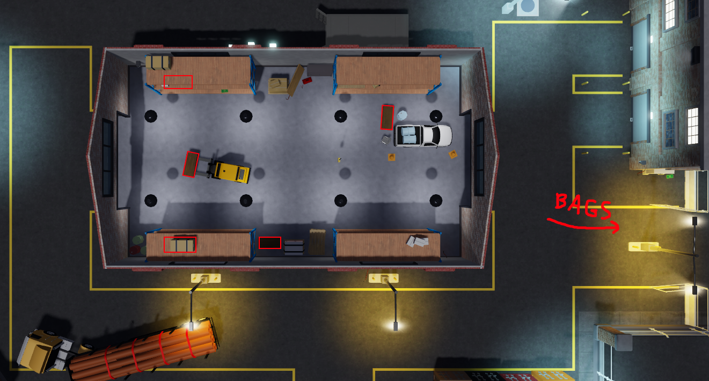
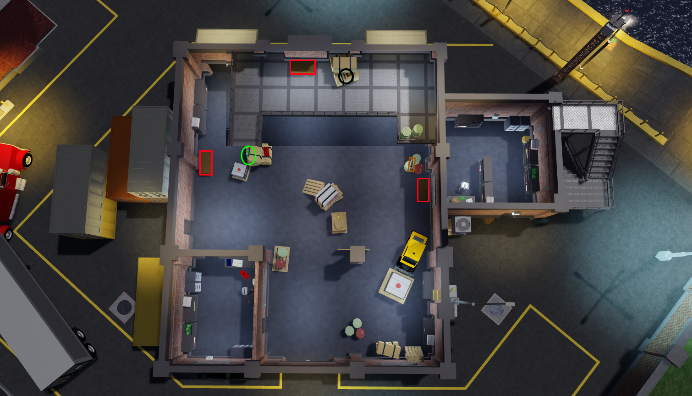
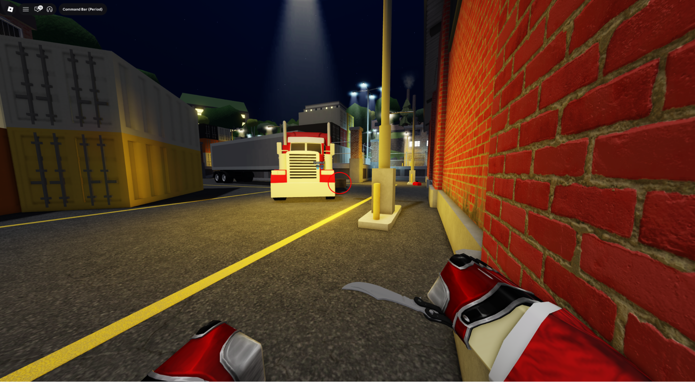
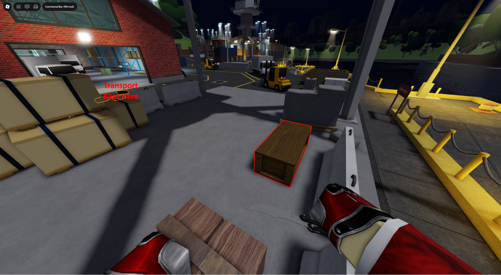
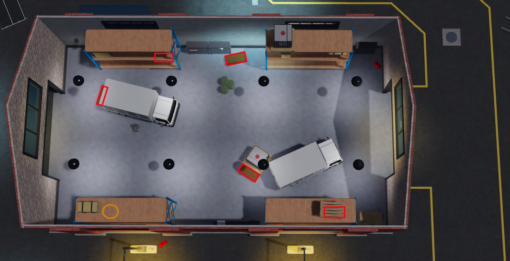
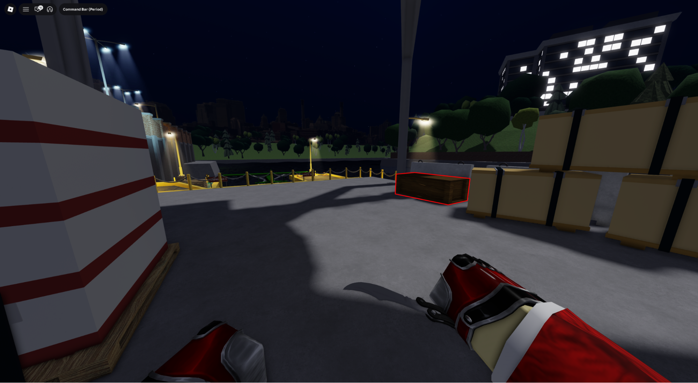

# Sweepot

Sweepot is featured on all versions of SSD\
Role 3’s main objective is to open most of the crates on the map.

ECM Times: 1:30, 1:50

1. Follow this path until you find a crowbar\
(most of the time you find a crowbar in the first 5 spots but the following path has been prepared in case of a theoretical worst case scenario)

2. Loot all of the crates in the spawn warehouse and throw any bags towards the 3 garages

3. In the transport building, loot all crates, bag the cash under the stairs, cola and weapon on the barrel

4. Throw all your bags and any bag left behind by r2 in front of the middle warehouse.\
Loot the crate by the truck

5. Loot the crate under the middle crane, If you brought a Jack of All Trades sentry, place it in this area

6. Loot all crates and bag the weapons in middle warehouse

7. Move all bags towards escape and loot the crate under escape crane

